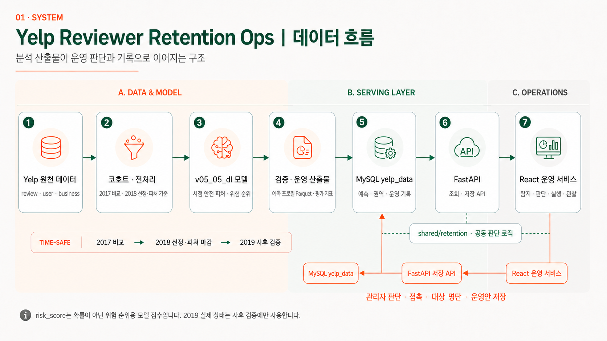
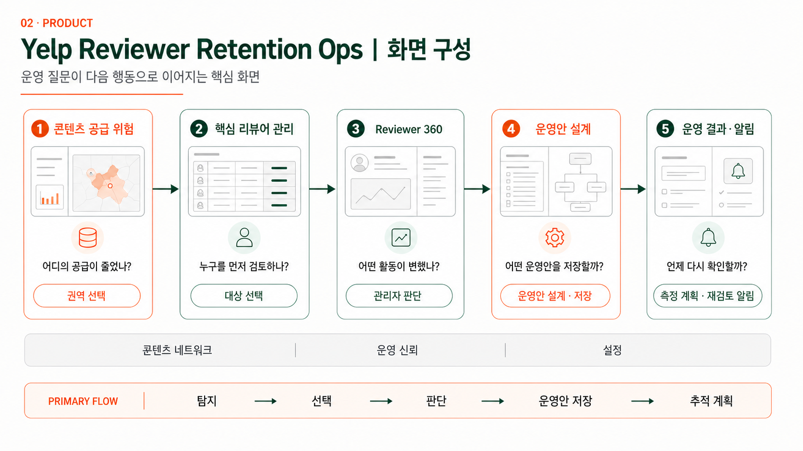
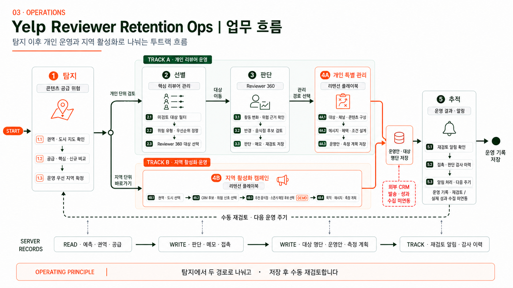

<div align="center">

# Yelp Reviewer Retention Ops

### 파워 리뷰어의 활동 위험을 탐지하고, 운영자의 판단과 다음 행동까지 연결하는 리텐션 운영 서비스

Yelp 음식 리뷰 활동을 바탕으로 다음 연도의 **파워 지위 유지 · 활동 약화 · 리뷰 활동 중단**을 예측하고<br>
권역 탐색, 우선 대상 선정, Reviewer 360, 운영안 저장과 재검토 기록을 하나의 흐름으로 제공합니다.

<br>


</div>

---

## 프로젝트 소개

파워 리뷰어는 음식점 콘텐츠 공급과 커뮤니티 활성화에 중요한 사용자입니다. 그러나 활동이 줄어든 뒤에야 문제를 발견하면 운영자가 적절한 시점에 대응하기 어렵습니다.

이 프로젝트는 다음 질문에 답하는 운영 제품을 목표로 합니다.

> 어느 지역의 리뷰 공급이 약해졌고, 누구를 먼저 검토하며, 어떤 근거로 무엇을 실행할 것인가?

| 운영 문제 | 프로젝트의 접근 |
|---|---|
| 활동 약화와 중단을 사후에 발견 | 시점 안전 피처로 다음 연도 유지·약화·중단을 예측 |
| 수천 명을 동일한 순서로 검토 | `risk_score` 기반 우선순위와 상위 20% CRM 검토 큐 제공 |
| 모델 결과만으로 이유를 알기 어려움 | Reviewer 360에서 활동량·작성 주기·탐색·반경 근거 제공 |
| 분석 결과와 운영 행동이 분리 | 관리자 판단, 대상 명단, 개인·지역 운영안과 재검토 기록을 서버에 저장 |

> `risk_score`는 보정된 이탈 확률이 아니라 **상대적인 위험 순위를 위한 모델 점수**입니다. 모델은 사용자의 상태를 확정하거나 운영자를 대신해 결정을 내리지 않습니다.

## 핵심 결과

| 항목 | 결과 |
|---|---:|
| 최종 모델 | `v05_05_dl` Lifecycle Fusion H2 |
| 개발 코호트 | 선정 연도 2010~2017, 31,420건 |
| OOF 검증 | Expanding-Time 5-Fold × 3 seeds, 24,596건 |
| Final Test | 2018년 선정 코호트 6,533명 |
| Primary CRM 검토 범위 | 위험 순위 상위 20%, 1,307명 |
| 운영 서비스 | React → FastAPI → MySQL |

## 데이터 흐름

<p align="center">
  
</p>

```text
2017년 비교
→ 2018년 파워 리뷰어 선정·피처 마감
→ 2019년 실제 상태 사후 검증
```

- 모든 모델 입력은 2018년 12월 31일 이전 정보만 사용합니다.
- 2019년 리뷰 수·활동 월·상태는 정답 생성과 사후 검증에만 사용합니다.
- React는 FastAPI를 통해 MySQL `yelp_data`를 조회하고 운영 기록을 저장합니다.
- 위험 유형·근거·전략 판단과 프로필 정규화의 기준 구현은 `shared/retention/`입니다.
- API 전환 전 정적 JSON은 정합성 확인과 복구용 export로만 보존하며, 현재 React에는 API 실패 시 자동 폴백 기능이 없습니다.

## 모델

### 문제 정의

선정 연도에 음식 관련 리뷰 10건 이상, 활동 월 3개월 이상인 파워 리뷰어를 대상으로 다음 연도의 상태를 분류합니다.

| 클래스 | 다음 연도 조건 |
|---|---|
| 유지 `retained` | 리뷰 10건 이상 AND 활동 월 3개월 이상 |
| 약화 `weakened` | 리뷰 1건 이상이며 리뷰 10건 미만 OR 활동 월 3개월 미만 |
| 중단 `stopped` | 음식 관련 리뷰 0건 |

### `v05_05_dl` 구조

| 구성 | 입력·역할 |
|---|---|
| 시계열 Branch | 월별 리뷰 수·활성 여부·고유 음식점 수·평균 작성 간격의 24개월 시퀀스를 GRU Hidden 64로 인코딩 |
| Lifecycle Branch | 계정 연차·과거 Elite 연도 수·선정 연도 Elite 여부·마지막 Elite 경과·최근 연속 유지의 5개 특성을 MLP Hidden 16으로 인코딩 |
| Hierarchical H2 Head | 유지 vs 위험군을 구분한 뒤 위험군을 약화 vs 중단으로 분류 |
| Ensemble | seed 42·2026·3405의 3개 모델 점수를 평균 |

### OOF 검증

OOF는 모델·임계값 선정에 사용한 사전 수락 기준입니다.

| 평가 지표 | 수락 기준 | 결과 | 판정 |
|---|---:|---:|---|
| Macro F1 | 0.5700 이상 | **0.5763** | PASS |
| Macro PR-AUC | 0.5900 이상 | **0.5980** | PASS |
| Precision@1000 | 90.0% 이상 | **90.60%** | PASS |
| 중증 오분류 | 2.5% 이하 | **2.19% · 538건** | PASS |

### Final Test

Final Test는 모델 선정에 사용하지 않은 2018년 코호트로 수행했습니다. 가중치와 임계값은 평가 전에 고정했으며, 결과를 확인한 뒤 수락 기준을 소급 적용하지 않았습니다.

| Macro F1 | Macro PR-AUC | Precision@1000 | 중증 오분류 | Top 20% Precision / Recall / Lift |
|---:|---:|---:|---:|---:|
| **0.5731** | **0.5962** | **89.90%** | **1.81%** | **89.29% / 29.55% / 1.48배** |

변수별 정량 중요도는 아직 산출하지 않았습니다. 월별 시퀀스와 Lifecycle 특성은 모델 입력이며, 각 특성의 독립적인 효과나 인과관계는 현재 결과만으로 단정하지 않습니다.

## 화면 구성

<p align="center">
  
</p>

| 단계 | 화면 | 운영 질문 | 주요 기능 |
|---:|---|---|---|
| 1 | 콘텐츠 공급 위험 | 어디의 공급이 줄었나? | 권역·도시 지도, 공급·핵심·신규 비교, 우선 지역 탐색 |
| 2 | 핵심 리뷰어 관리 | 누구를 먼저 검토하나? | 위험 유형·우선순위·판단 상태 필터, 검색, 정렬, 상세 이동 |
| 3 | Reviewer 360 | 어떤 활동이 변했나? | 활동량·작성 주기·탐색·반경·음식점 근거와 관리자 판단 |
| 4 | 운영안 설계 | 어떤 운영안을 저장할까? | 개인 특별 관리안과 지역 활성화 캠페인, 대상·채널·콘텐츠·측정 계획 저장 |
| 5 | 운영 결과·알림 | 언제 다시 확인할까? | 판단·명단·운영안·접촉·감사·재검토 알림 이력 |

콘텐츠 네트워크, 운영 신뢰, 사용자·권한 설정과 스폰서 매장 관리 화면이 주 흐름을 보조합니다.

## 업무 흐름

<p align="center">
  
</p>

탐지 이후에는 두 경로로 나뉩니다.

- **Track A · 개인 리뷰어 운영**: 핵심 리뷰어 선택 → Reviewer 360 근거·판단 → 개인 특별 관리안 저장
- **Track B · 지역 활성화 운영**: 권역·도시 선택 → CRM 후보·위험 신호 선택 → 추천 음식점·스폰서 매장 후보 검토 → 지역 운영안 저장

저장된 결과는 대상 명단·운영안·재검토 알림·감사 이력으로 다시 합쳐집니다. 다음 운영 주기는 자동 집행이 아니라 운영자가 기록을 확인하는 **수동 재검토 흐름**입니다.

> 그림의 메시지·채널·혜택은 운영안 검토 범주를 뜻합니다. 실제 이메일·푸시·쿠폰·혜택 제공, 외부 CRM 발송과 성과 수집은 연동되지 않았으며 현재 프로젝트 범위에서 제외됩니다. 스폰서 매장 정보는 기능 검증용 데모 데이터입니다.

## 기술 스택

| 영역 | 기술 |
|---|---|
| Data | Python, Pandas, NumPy, PyArrow, DuckDB |
| ML / DL | scikit-learn, XGBoost, LightGBM, PyTorch |
| Frontend | React 19, Vite 8, Tailwind CSS 4, Recharts, Leaflet |
| API / Auth | FastAPI, SQLAlchemy, PyMySQL, Argon2 |
| Database | MySQL `yelp_data`, `reviewer_retention_auth` |
| Shared logic | `shared/retention/` |
| Test / QA | Pytest, unittest, ESLint, Vite build, 관리자 UI 135개 시나리오 |
| Collaboration | Git, GitHub, Notion, VS Code, DBeaver |

## 로컬 실행

### 1. 사전 준비

- Python 3.12, Node.js, MySQL을 준비합니다.
- MySQL에 분석·운영 DB `yelp_data`와 인증 DB `reviewer_retention_auth`를 분리해 구성합니다.
- `database/.env`와 `auth_service/.env`를 각 예시 파일에 맞춰 작성합니다.
- 데이터베이스 DDL·적재 절차는 [database/README.md](database/README.md)를 따릅니다.

```powershell
python -m venv venv
.\venv\Scripts\Activate.ps1
python -m pip install --upgrade pip
python -m pip install -r requirements.txt -r api\requirements.txt -r auth_service\requirements.txt

cd app
npm install
cd ..
```

딥러닝 모델을 재학습하려면 별도로 설치합니다.

```powershell
python -m pip install -r requirements-dl.txt
```

### 2. 서비스 실행

각 명령을 프로젝트 루트의 별도 터미널에서 실행합니다.

```powershell
# 분석·운영 API — http://127.0.0.1:8000
python -m uvicorn api.main:app --reload --port 8000

# 인증 서비스 — http://127.0.0.1:8100
python -m uvicorn auth_service.main:app --reload --port 8100

# React — http://localhost:5173
cd app
npm run dev
```

Windows에서는 `RUN_LOCAL.cmd`로 멈춰 있는 로컬 서비스를 한 번에 시작할 수 있습니다. 최초 관리자 생성과 자세한 환경 설정은 [로컬 실행 가이드](docs/04_architecture_and_guides/LOCAL_RUN_GUIDE.md)를 참고하세요.

### 3. 검증

```powershell
python -m compileall -q api auth_service shared
python -m unittest tests.test_demo_contract tests.test_historical_metric_loaders tests.test_reference_data_seed
python -m pytest auth_service/tests -q

cd app
npm run lint
npm run build
```

## 모델 재생성

최종 가중치·전처리 객체는 `.gitignore` 대상인 `models/experiments/v05_05_dl/`에 생성됩니다. 새 환경에서는 승인된 보관 위치에서 전달받거나 아래 절차로 재생성해야 합니다.

```powershell
python pipeline/v05_05_dl/train.py
python pipeline/v05_05_dl/evaluate_test.py
```

| 산출물 | 경로 |
|---|---|
| 3-seed 가중치 | `models/experiments/v05_05_dl/seed_{42,2026,3405}_state_dict.pt` |
| 전처리 객체 | `models/experiments/v05_05_dl/preprocessing.joblib` |
| 모델 메타데이터 | `models/experiments/v05_05_dl/metadata.json` |
| Final Test 예측 프로필 | `data/processed/predictions/test_retention_profiles_v05_05_dl.parquet` |
| 평가 결과 | `reports/experiments/v05_05_dl/` |

## 현재 검증·배포 상태

서비스 배포와 `v05_05_dl` 연동은 확인했지만, 최종 운영 승인은 아직 보류 상태입니다.

| 검증 | 결과 |
|---|---|
| React lint / build | PASS |
| 배포 워크플로 단위 테스트 | 9건 PASS |
| v05 운영 컨텍스트·UI·모델 로더 계약 | 19건 PASS |
| 인증 서비스 테스트 | 4건 PASS · 1건 FAIL |
| 관리자 UI 전체 QA | 135건 중 PASS 95 · FAIL 17 · PARTIAL 6 · NOT RUN 17 |
| 최종 배포 승인 | **보류** |

주요 배포 차단 항목은 비인증 API 접근, 권역 정책 우회, HTTPS 미적용, snooze 영속성, 인증 테스트 계약 불일치입니다. 이 상태를 숨기지 않고 [배포·테스트 결과서](docs/02_reports/03_model_deployment_test_report.md)와 [QA 실행 결과](docs/qa/ADMIN_UI_QA_EXECUTION_2026-08-05.md)에 기록했습니다.

## 프로젝트 구조

```text
SKN34-2nd-5Team/
├─ app/                    # React 운영 서비스
├─ api/                    # 분석·운영 FastAPI
├─ auth_service/           # 로그인·회원가입·승인·세션 FastAPI
├─ shared/retention/       # 위험 근거·전략·정규화·직렬화 기준 구현
├─ pipeline/               # ML·DL 피처 생성, 학습, 평가
├─ database/               # MySQL DDL·적재·검증
├─ v05/                    # v05 운영 컨텍스트 파이프라인·DB 확장
├─ configs/                # 분석·코호트 설정
├─ data/                   # raw·interim·processed 데이터
├─ models/                 # 모델·메타데이터 로컬 산출물
├─ reports/                # 실험 결과·평가표
├─ docs/                   # 요구사항·WBS·결과서·결정·가이드·QA
├─ tests/                  # 데이터·모델·UI 계약 테스트
└─ archive/                # 이전 Streamlit 프로토타입 보존
```

## 팀

| 팀원 | 주요 수행 영역 |
|---|---|
| 최인영 | MySQL DB 계층·ERD·적재·품질 검증, 인증·관리자 기능, AWS 배포, XGBoost 신뢰 지표 |
| 김기호 | 전처리·피처 파이프라인, v04·v05 ML 학습·평가, 데이터 전처리·모델 학습 결과서 |
| 김동섭 | 운영 UX·제품 문구·사용성 QA, Streamlit→React 전환 참여, v05 DL 실험·Final Test |
| 이홍규 | 팀장, 데이터 계약·서비스 통합, React·FastAPI·공용 로직·인증 연동 |

상세 일정, 선행 관계와 협업·검토 범위는 [WBS](docs/01_business/WBS.md)에 기록했습니다.

## 문서

| 문서 | 설명 |
|---|---|
| [프로젝트 요구사항 명세서](docs/01_business/project_requirements.md) | 범위, 요구사항, 수락 기준, QA·배포 게이트 |
| [WBS](docs/01_business/WBS.md) | 역할, 일정, 선행 관계, 산출물과 현재 상태 |
| [데이터 전처리 결과서](docs/02_reports/01_data_preprocessing_report.md) | 코호트·결측·피처·시간 분할·전처리 검증 |
| [모델 학습 결과서](docs/02_reports/02_model_training_report.md) | 후보 비교, `v05_05_dl`, OOF·Final Test, 산출물 계약 |
| [모델 배포·테스트 결과서](docs/02_reports/03_model_deployment_test_report.md) | 정적 검사, 운영 선택 재검증, 배포 게이트 판정 |
| [비즈니스 시나리오](docs/01_business/business_scenarios.md) | 운영 문제와 활용 시나리오 |
| [로컬 실행 가이드](docs/04_architecture_and_guides/LOCAL_RUN_GUIDE.md) | MySQL·API·인증·React 실행 절차 |
| [AWS 배포 가이드](docs/04_architecture_and_guides/AWS_DEPLOYMENT.md) | 배포 구성과 운영 절차 |
| [QA 케이스](docs/qa/ADMIN_UI_QA_CASES.md) | 관리자 UI 135개 테스트 시나리오 |
| [QA 실행 결과](docs/qa/ADMIN_UI_QA_EXECUTION_2026-08-05.md) | PASS·FAIL·미실행 결과와 결함 |
| [의사결정 기록](docs/06_decisions/) | 데이터·모델·코호트·운영 정책 결정 |

## 범위와 한계

- 모델 점수는 확률이나 의학적 진단이 아닙니다.
- 리뷰 활동 위치를 거주지·직장·실제 생활 반경으로 해석하지 않습니다.
- 운영안은 검증된 처방이 아니라 운영자가 검토할 가설입니다.
- 이메일·푸시·쿠폰·혜택 제공과 실제 CRM 발송은 구현 범위에서 제외합니다.
- 캠페인 성과와 인과 효과는 실제 실행·성과 데이터가 없어 보장하지 않습니다.
- v04 산출물과 이전 Streamlit 앱은 비교·롤백·이력 확인 목적으로 보존합니다.

---

<div align="center">

### 모델이 답을 대신하는 서비스가 아니라, 운영자가 더 좋은 판단을 내리게 하는 서비스

`데이터로 발견하고 · 근거로 판단하고 · 운영 기록으로 연결합니다`

Yelp Open Dataset 기반 비상업 분석 프로젝트이며 Yelp의 공식 서비스가 아닙니다.

</div>
