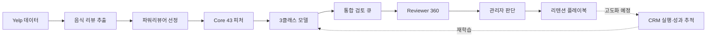

<div align="center">

# 🔄 Reviewer Retention Operations

### 파워리뷰어의 활동 변화를 발견하고, 운영자의 다음 행동까지 연결합니다

Yelp 음식 리뷰 활동을 기반으로 다음 연도의  
**파워 지위 유지 · 활동 약화 · 리뷰 활동 중단**을 예측하는 운영 서비스

<br>


<br>


</div>

<br>

## 💡 프로젝트 소개

파워리뷰어는 음식 콘텐츠 공급과 커뮤니티 활성화에 중요한 사용자다.
하지만 리뷰 활동이 줄어든 뒤에야 이탈을 알게 되면 적절한 시점에 대응하기 어렵다.

이 프로젝트는 리뷰 수, 활동 월, 작성 간격, 음식점 탐색 변화를 이용해
위험 리뷰어를 먼저 찾고, 운영자가 근거를 확인한 뒤 관리 방향을 결정하도록 돕는다.

| 문제 | 해결 | 운영 방식 |
|---|---|---|
| 활동 약화와 중단을 사후에 발견 | 다음 연도 유지·약화·중단 예측 | 모델이 아닌 운영자가 최종 판단 |
| 수천 명을 동일한 순서로 검토 | 통합 우선순위 큐 제공 | 상위 대상부터 활동 근거 확인 |
| 위험 신호와 개입 전략이 분리 | Reviewer 360과 플레이북 연결 | 판단 → 전략 → 사후 검증 구조 |

> 모델 점수는 보정된 실제 확률이 아니다.  
> 사용자의 상태를 자동 확정하지 않고 **검토 우선순위와 판단 근거**로 사용한다.

<br>

## 👥 팀

| 담당자 | 담당 영역 | 핵심 산출물 |
|---|---|---|
| **최인영** | 데이터베이스 | MySQL ERD, 데이터 적재·품질 검증, DBeaver 운영 |
| **김기호** | 데이터·모델 | 라벨·피처 설계, 시간 5-Fold, 모델 검증·재학습 |
| **김동섭** | 서비스 UX | Streamlit 정보 구조, 화면 설계, 사용성·발표 QA |
| **이홍규** | 통합·프론트 | 데이터 계약, 서비스 연결, 테스트·배포 구조 |

<br>

## 🔁 전체 파이프라인



```text
상황 파악 → 대상 선택 → 활동 근거 확인 → 관리자 판단 → 전략 검토 → 성과 확인
```

<br>

## 📊 프로젝트 핵심 결과

| 운영 후보 | 예측 상태 | 입력 피처 | 상위 20% Precision | 실제 위험 포착 |
|---:|---:|---:|---:|---:|
| **6,533명** | **3개 클래스** | **Core 43개** | **87.38%** | **1,142명** |

### v04 모델

| Macro F1 | Macro PR-AUC | Macro ROC-AUC | OOF → Test 차이 |
|---:|---:|---:|---:|
| **0.5521** | **0.5792** | **0.7561** | **0.0041** |

| 실제 상태 | 인원 | Precision | Recall | F1 |
|---|---:|---:|---:|---:|
| 파워 지위 유지 | 2,584명 | 65.31% | 58.94% | 0.6196 |
| 파워 지위 약화 | 3,065명 | 58.89% | 58.37% | 0.5863 |
| 리뷰 활동 중단 | 884명 | 39.64% | 52.15% | 0.4504 |

5-Fold pooled OOF Macro F1은 0.5562, 최종 Test는 0.5521이다.
연도 이동에 따른 차이가 작아 검증과 Test 성능이 비교적 안정적이었다.

### 통합 검토 큐

| 검토 범위 | 대상 | Precision | 지위 상실 Recall | Lift |
|---|---:|---:|---:|---:|
| **상위 20%** | **1,307명** | **87.38%** | **28.92%** | **1.45배** |
| 상위 30% | 1,960명 | 84.64% | 42.01% | 1.40배 |
| 상위 40% | 2,614명 | 82.36% | 54.52% | 1.36배 |

현재 비교 기준은 상위 20%다. 실제 운영 인력과 처리 용량이 정해지면
Precision과 Recall의 균형을 보고 기본 검토 범위를 결정한다.

<details>
<summary><strong>v03과 v04는 무엇이 다른가요?</strong></summary>

<br>

| 항목 | v03 | v04 |
|---|---:|---:|
| 운영 대상 | 4,157명 | 6,533명 |
| 대상 정의 | 2017 파워리뷰어 + 2018 하반기 활동 | 2018 파워리뷰어 전체 |
| Macro F1 | 0.5754 | 0.5521 |
| 약화 Recall | 54.67% | 58.37% |
| 상위 20% 포착 | 773명 | 1,142명 |

v03은 연속 활동 조건으로 대상을 한 번 더 좁힌 상대적으로 쉬운 코호트다.
v04는 2018년 파워리뷰어 전체를 다루므로 성능은 조금 낮지만 실제 운영 질문과
더 잘 맞는다. v03은 비교 기준으로 보존하고 v04를 운영 모델 후보로 관리한다.

</details>

<br>

## 🖥️ 운영 서비스

| 단계 | 화면 | 운영자가 확인하는 것 | 다음 행동 |
|---:|---|---|---|
| 1 | **운영 홈** | 운영 규모, 우선 검토 큐, 정책 성능 | 오늘 검토할 대상 선택 |
| 2 | **리뷰어 관리** | 검토 상태, 위험 유형, 모델 판단 | 리뷰어 검색·정렬·선택 |
| 3 | **Reviewer 360** | 활동량·작성 주기·탐색 변화 | 관리자 판단 |
| 4 | **리텐션 플레이북** | 판단에 맞는 전략과 필요 데이터 | 개입 전략 검토 |
| 5 | **모델 신뢰·로드맵** | 성능, 혼동행렬, Top-K, 준비도 | 정책과 고도화 범위 결정 |

### 화면의 역할

```text
운영 홈
└─ 누구부터 볼 것인가

리뷰어 관리
└─ 조건에 맞는 대상을 어떻게 찾을 것인가

Reviewer 360
└─ 왜 이 리뷰어를 검토해야 하는가

리텐션 플레이북
└─ 검토 결과에 따라 무엇을 할 것인가
```

> 현재 Streamlit은 v03 데이터에 연결되어 있다.  
> v04 데이터 계약과 화면 변경안 승인 후 기본 연결을 전환한다.

<br>

## 🧠 v04 모델 설계

### 코호트

```text
선정연도 음식 리뷰 10건 이상
AND
선정연도 활동 월 3개월 이상
```

| 비교 | 선정·예측 기준 | 정답 |
|---:|---:|---:|
| 2017년 | 2018년 | 2019년 |

기존 하반기 1건 조건은 사용하지 않는다. 해당 조건이 다음 연도 지위 상실률이
91.04%인 고위험 사용자 268명을 코호트에서 미리 제외하는 문제가 확인됐기 때문이다.

### 3클래스 라벨

| 상태 | 조건 |
|---|---|
| **유지** | 리뷰 10건 이상 AND 활동 월 3개월 이상 |
| **약화** | 리뷰 1건 이상이며 리뷰 10건 미만 OR 활동 월 3개월 미만 |
| **중단** | 리뷰 0건 |

### 모델 선택

```text
2013~2017 확장형 시간 5-Fold
→ 180개 규제·가중치·임계값 조합 비교
→ 2010~2017 전체 재학습
→ 2018 후보의 2019 상태 최종 Test
```

| 모델 | 규제 | C | 가중치 | 약화 임계값 | 중단 임계값 |
|---|---|---:|---|---:|---:|
| Logistic Regression | L1 | 0.01 | balanced | 0.36 | 0.45 |

상세한 코호트·모델 근거는
[DEC-010](docs/decisions/DEC-010_v04_cohort_time_structure.md)과
[v04 모델 보고서](reports/modeling/multiclass_model_performance_v04.md)를 참고한다.

<br>

## 🧰 기술 스택

| 영역 | 기술 |
|---|---|
| Language | Python |
| Data | Pandas, NumPy, PyArrow, DuckDB |
| Model | scikit-learn, Joblib |
| Service | Streamlit, Plotly |
| Database | MySQL |
| DB Client | DBeaver |
| Test | Pytest |
| Collaboration | Git, GitHub, VS Code, Notion |

<br>

## 🚀 실행

### 1. 가상환경과 패키지

```powershell
python -m venv venv
.\venv\Scripts\Activate.ps1
python -m pip install --upgrade pip
python -m pip install -r requirements.txt
python -m pip install -r requirements-streamlit.txt
```

### 2. Streamlit

```powershell
.\run_app.ps1
```

또는:

```powershell
.\venv\Scripts\python.exe -m streamlit run app\streamlit_app.py
```

브라우저에서 `http://localhost:8501`로 접속한다.

### 3. 빠른 검증

```powershell
.\venv\Scripts\python.exe -m pytest tests
.\venv\Scripts\python.exe -m compileall app
```

<br>

## ♻️ v04 재생성

다음 노트북을 순서대로 실행한다.

```text
1. notebooks/10_v04_cohort_feature_engineering.ipynb
2. notebooks/11_v04_multiclass_retention_modeling.ipynb
```

첫 번째 노트북은 37,953표본의 코호트와 Core 43 피처를 생성한다.
두 번째 노트북은 5-Fold 후보 탐색, 최종 모델 학습, 예측 프로필과 평가표를 생성한다.

<details>
<summary><strong>주요 v04 산출물 보기</strong></summary>

<br>

```text
configs/analysis_config_v04.yaml

data/interim/rolling/
└─ culinary_rolling_cohort_master_v04.parquet

data/processed/
├─ modeling_dataset_rolling_v04.parquet
└─ predictions/final_test_retention_profiles_v04.parquet

models/
├─ final_core_logistic_multiclass_v04.joblib
└─ final_core_logistic_multiclass_metadata_v04.json

reports/
├─ modeling/multiclass_model_performance_v04.md
└─ tables/
   ├─ multiclass_model_candidates_v04.csv
   ├─ multiclass_validation_results_v04.csv
   ├─ multiclass_confusion_matrix_v04.csv
   └─ multiclass_top_k_performance_v04.csv
```

일부 데이터·모델 파일은 `.gitignore` 대상이다. 새로운 환경에서는 파일을
별도로 전달받거나 노트북으로 재생성해야 한다.

</details>

<br>

## 📁 프로젝트 구조

```text
SKN34-2nd-5Team/
├─ app/                    # Streamlit 운영 서비스
├─ app_data_prototype/     # 과거 분석 프로토타입 · 수정 금지
├─ configs/                # 분석·코호트 설정
├─ data/                   # raw · interim · processed
├─ docs/                   # 요구사항·계약·결정 문서
├─ models/                 # 모델·메타데이터
├─ notebooks/              # 데이터·피처·모델 재현
├─ reports/                # 모델 보고서·평가표
├─ tests/                  # 데이터·UI 계약 테스트
├─ requirements.txt
├─ requirements-streamlit.txt
├─ run_app.bat
└─ run_app.ps1
```

<br>

## 🗺️ 현재 상태와 다음 단계

| 구분 | 상태 | 설명 |
|---|---|---|
| v04 코호트·피처 | ✅ 완료 | 2018 파워리뷰어 전체와 Core 43 |
| v04 모델 검증 | ✅ 완료 | 5-Fold, Test, 혼동행렬, Top-K |
| Streamlit 운영 화면 | ✅ 구현 | 현재 v03 데이터 연결 |
| Streamlit v04 전환 | 🔄 다음 단계 | 데이터 계약·화면 변경안 승인 필요 |
| MySQL 운영 적재 | 🟣 고도화 예정 | ERD, 배치, 판단·감사 이력 |
| CRM 실행 연동 | 🟣 외부 연동 필요 | 채널, 동의, 캠페인 결과 |
| 개입 효과 검증 | 🟣 데이터 필요 | 재참여·성과 데이터 축적 |

<br>

## 📚 상세 문서

| 문서 | 내용 |
|---|---|
| [CODEX_HANDOFF](docs/CODEX_HANDOFF.md) | 프로젝트 상태와 인수인계 |
| [PROJECT_REQUIREMENTS](docs/PROJECT_REQUIREMENTS.md) | 제품·분석 요구사항 |
| [BUSINESS_SCENARIOS](docs/BUSINESS_SCENARIOS.md) | 운영 시나리오 |
| [STREAMLIT_DATA_CONTRACT](docs/STREAMLIT_DATA_CONTRACT.md) | 화면 데이터 계약 |
| [STREAMLIT_REDESIGN_BRIEF](docs/ui/STREAMLIT_REDESIGN_BRIEF.md) | UI 설계 원칙 |
| [DEC-008](docs/decisions/DEC-008_retention_state_definition.md) | 유지·약화·중단 정의 |
| [DEC-010](docs/decisions/DEC-010_v04_cohort_time_structure.md) | v04 코호트·시간 구조 |
| [DEC-011](docs/decisions/DEC-011_retention_operating_playbook_policy.md) | 운영 분류·플레이북 정책 |
| [v04 모델 보고서](reports/modeling/multiclass_model_performance_v04.md) | 모델·Top-K 상세 결과 |

<br>

---

<div align="center">

### 모델이 답을 대신하는 서비스가 아니라, 운영자가 더 좋은 판단을 내리게 하는 서비스

`데이터로 발견하고 · 근거로 판단하고 · 전략으로 연결합니다`

</div>

