<div align="center">

# Yelp Reviewer Retention Ops

### 파워 리뷰어의 활동 위험을 탐지하고, 운영자의 판단과 다음 행동까지 연결하는 리텐션 운영 서비스

Yelp 음식 리뷰 활동을 바탕으로 다음 연도의 **파워 지위 유지 · 파워 지위 약화 · 리뷰 활동 중단**을 예측하고,<br>
권역 탐색부터 대상 선정, Reviewer 360, 운영안 저장과 재검토 기록까지 하나의 운영 흐름으로 제공합니다.

<br>


</div>

---

## 목차

1. [팀 소개](#팀-소개)
2. [프로젝트 개요](#프로젝트-개요)
3. [기술 스택](#기술-스택)
4. [WBS & 개발 일정](#wbs--개발-일정)
5. [요구사항 명세서 미리보기](#요구사항-명세서-미리보기)
6. [프로젝트 구조](#프로젝트-구조)
7. [ERD](#erd)
8. [데이터 흐름 및 전처리](#데이터-흐름-및-전처리)
9. [모델](#모델)
10. [화면 구성](#화면-구성)
11. [업무 흐름](#업무-흐름)
12. [실행 가이드](#실행-가이드)
13. [모델 재생성](#모델-재생성)
14. [현재 검증·배포 상태](#현재-검증배포-상태)
15. [트러블슈팅](#트러블슈팅)
16. [향후 개선 방향](#향후-개선-방향)
17. [문서](#문서)
18. [범위와 한계](#범위와-한계)
19. [회고](#회고)

---

## 팀 소개

| 팀원 | 주요 수행 영역 |
|---|---|
| 최인영 | MySQL DB 계층·ERD·적재·스키마 검증, 인증·관리자 기능, AWS 배포, XGBoost 선별 지원,발표자료 및 발표 |
| 김기호 | v04 전처리·피처 파이프라인, v05 ML 학습·평가, 데이터 전처리·모델 학습 결과서 |
| 김동섭 | Streamlit→React 전환 참여, v05 DL 실험·Final Test, 테스트시나리오 생성 및 QA|
| 이홍규 | 팀장, v04 프로토타입 제작, 공통 데이터 계약·서비스 통합, UI, UX, 제품 문서 통합 |

상세 역할, 실제 참여 범위, 선행 관계와 산출물은 [전체 WBS](docs/01_business/WBS.md)에서 확인할 수 있습니다.

---

## 프로젝트 개요

파워 리뷰어는 음식 콘텐츠 공급과 커뮤니티 활성화에 중요한 사용자입니다. 하지만 활동 감소를 사후에 발견하면 운영자가 적절한 시점에 대응하기 어렵습니다.

이 프로젝트는 다음 질문에 답하는 운영 제품을 목표로 합니다.

> 어느 지역의 리뷰 공급이 약해졌고, 누구를 먼저 검토하며, 어떤 근거로 무엇을 실행할 것인가?

| 운영 문제 | 프로젝트의 접근 |
|---|---|
| 활동 약화와 중단을 사후에 발견 | 시점 안전 피처로 다음 연도 유지·약화·중단 예측 |
| 검토 순서를 일관되게 정하기 어려움 | `risk_score` 기반 상대적 위험 순위와 상위 20% 검토 범위 제공 |
| 모델 결과만으로 이유를 설명하기 어려움 | Reviewer 360에서 활동량·작성 주기·탐색·반경 근거 제공 |
| 분석 결과와 운영 행동이 분리됨 | 관리자 판단, 대상 명단, 개인·권역 운영안과 재검토 기록을 서버에 저장 |

> `risk_score`는 보정된 이탈 확률이 아니라 **상대적인 위험 순위를 정하기 위한 모델 점수**입니다. 모델은 운영자의 결정을 대신하지 않습니다.

### 핵심 결과

| 항목 | 결과 |
|---|---:|
| 최종 모델 | `v05_05_dl` Lifecycle Fusion H2 |
| 개발 코호트 | 선정 연도 2010~2017, 31,420건 |
| OOF 검증 | Expanding-Time 5-Fold × 3 seeds, 24,596건 |
| Final Test | 2018년 선정 코호트 6,533명 |
| OOF Macro F1 / Macro PR-AUC | **0.5763 / 0.5980** |
| OOF Precision@1000 | **90.60%** |
| Final Test Macro F1 / Macro PR-AUC | **0.5731 / 0.5962** |
| Final Test Precision@1000 | **89.90%** |
| Primary CRM 검토 범위 | 위험 순위 상위 20%, 1,307명 |
| Top 20% Precision / Lift | **89.29% / 1.48배** |
| 운영 서비스 | React → FastAPI → MySQL |

---

## 기술 스택

### Frontend

| 분류 | 기술 |
|---|---|
| 프레임워크 |   |
| 스타일·시각화 |  `Recharts` `Leaflet` |

### Backend / Database

| 분류 | 기술 |
|---|---|
| API·인증 |  `SQLAlchemy` `PyMySQL` `Argon2` |
| 데이터베이스 |  `yelp_data` `reviewer_retention_auth` |
| 공통 도메인 로직 | `shared/retention/` |

### Data / ML·DL

| 분류 | 기술 |
|---|---|
| 데이터 처리 |  `Pandas` `NumPy` `PyArrow` `DuckDB` |
| ML | `scikit-learn` `XGBoost` `LightGBM` |
| DL |  |

### Test / Collaboration

| 분류 | 기술·도구 |
|---|---|
| 정적·자동 검증 | `Pytest` `unittest` `ESLint` `Vite build` |
| 사용자 QA | 관리자 UI 135개 시나리오 |
| 협업 |  `Git` `Notion` `VS Code` `DBeaver` |

---

## WBS & 개발 일정

README의 WBS는 작업 수행과 최종 검증·승인을 분리해 표시합니다. 세부 담당자와 작업 간 의존 관계는 [전체 WBS](docs/01_business/WBS.md)를 기준으로 합니다.

| 단계 | 7/22~24 | 7/24~27 | 7/27~30 | 7/31~8/3 | 8/4~5 | 수행 상태 | 검증·승인 상태 |
|---|:---:|:---:|:---:|:---:|:---:|---|---|
| 기획·요구사항 | 🟩 | 🟩 |  |  | 🟩 | 완료 | 완료 |
| 데이터·전처리·DB | 🟩 | 🟩 | 🟩 | 🟩 | 🟩 | 완료 | 결과서 최종 검토 |
| 모델 개발·평가 |  | 🟩 | 🟩 | 🟩 | 🟩 | 완료 | 산출물 보관 정책 확인 필요 |
| React·API·DB 통합 |  | 🟩 | 🟩 | 🟩 | 🟩 | 완료 | 핵심 연결 확인 |
| 운영 기능 구현 |  |  | 🟩 | 🟩 | 🟩 | 완료 | 일부 QA 미통과 |
| 최종 문서화 |  |  |  |  | 🟩 | 완료 | README·필수 문서 반영 완료 |
| 배포·회귀 QA |  |  |  | 🟩 | 🟩 | 서비스 배포 | **최종 승인 보류** |

**범례:** 🟩 해당 기간 수행 · 빈칸 수행 기간 아님

> 핵심 개발과 서비스 연동은 완료됐지만 기능·보안 QA 미통과 항목이 남아 있어, 구현 완료와 배포 승인을 동일하게 표시하지 않습니다.

---

## 요구사항 명세서 미리보기

| ID | 핵심 요구사항 | 현재 상태 | 확인 근거 |
|---|---|---|---|
| BR-01 | 권역·도시별 리뷰 공급 변화 탐지 | 완료 | 지역 API·운영 홈 |
| BR-02 | 유지·약화·중단 3클래스 예측 | 완료 | `v05_05_dl` |
| BR-03 | 위험 순위 기반 CRM 우선 대상 선정 | 완료 | 상위 20% 1,307명 |
| BR-04 | Reviewer 360 활동 근거 제공 | 완료 | 관련 QA PASS |
| BR-05 | 관리자 판단·메모·접촉 저장 | 부분 완료 | 기본 저장 PASS, 스누즈 복원 FAIL |
| BR-06 | 개인·권역 운영안 설계·저장 | 부분 완료 | 저장 PASS, CSV·삭제 등 미충족 |
| BR-07 | 운영 결과·감사·알림 이력 추적 | 부분 완료 | 주요 이력 PASS, 일부 미실행 |

데이터·모델·기능·보안·비기능 요구사항과 수락 기준은 [프로젝트 요구사항 명세서](docs/01_business/project_requirements.md)에서 확인할 수 있습니다.

---

## 프로젝트 구조

### 핵심 실행 경로

| 구분 | 핵심 경로 | 역할 |
|---|---|---|
| 운영 데이터 | `app/` → `api/` → MySQL `yelp_data` | React 화면에서 예측·권역·운영 기록 조회 및 저장 |
| 인증·승인 | `app/` → `auth_service/` → MySQL `reviewer_retention_auth` | 로그인, 세션, 사용자 승인과 권한 관리 |
| 공통 판단 로직 | `shared/retention/` → `api/`·이전 앱·export | 위험 유형, 판단 근거, 운영안과 응답 정규화의 기준 구현 |
| 모델 재생성 | `pipeline/` → `models/`·`reports/` → DB/API | 피처 생성, 학습, 평가 및 운영 산출물 갱신 |
| 프로젝트 문서 | `docs/` | 요구사항, WBS, 결과서, QA, 의사결정과 실행 가이드 |

> 현재 React 서비스의 운영 데이터는 정적 JSON이 아니라 `app/` → `api/` → MySQL `yelp_data` 경로로 제공됩니다.

<details>
<summary><strong>전체 디렉터리 구조 보기</strong></summary>

```text
SKN34-2nd-5Team/
├─ app/                    # React 운영 서비스
├─ api/                    # 분석·운영 FastAPI
├─ auth_service/           # 로그인·회원가입·승인·세션 FastAPI
├─ shared/retention/       # 위험 근거·전략·정규화·직렬화 기준 구현
├─ pipeline/               # ML·DL 피처 생성, 학습, 평가
├─ database/               # MySQL DDL·적재·검증
├─ v05/                    # v05 운영 컨텍스트 파이프라인·DB 확장
├─ configs/                # 분석·코호트 설정
├─ data/                   # raw·interim·processed 데이터
├─ models/                 # 모델·메타데이터 로컬 산출물
├─ reports/                # 실험 결과·평가표
├─ docs/                   # 요구사항·WBS·결과서·가이드·QA
├─ tests/                  # 데이터·도메인·API 계약 테스트
└─ archive/                # 이전 Streamlit 프로토타입 보존
```

</details>

위험 유형·근거·전략 판단과 응답 정규화의 기준 구현은 `shared/retention/`입니다.

---

## ERD

분석·운영 DB인 `yelp_data`와 인증 DB인 `reviewer_retention_auth`를 분리해 구성했습니다.

### 데이터·모델 ERD

<p align="center">
  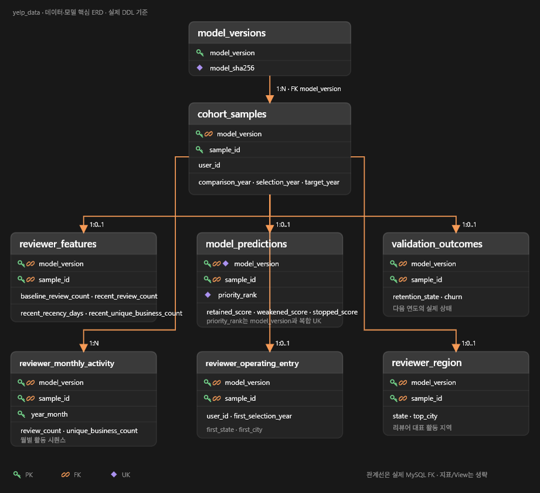
</p>

### 타깃 명단·운영 ERD

<p align="center">
  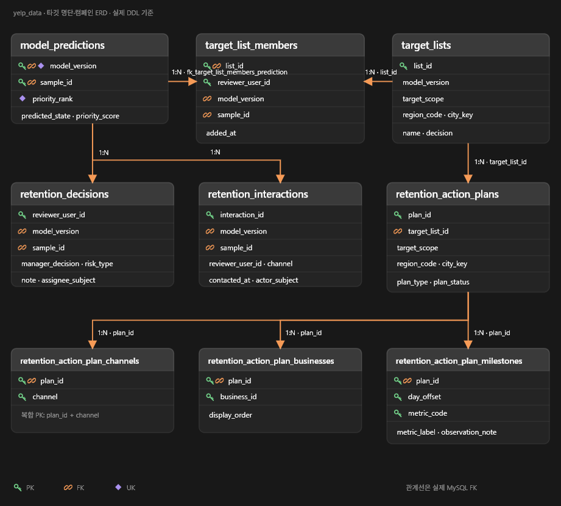
</p>

### 인증·승인 ERD

<p align="center">
  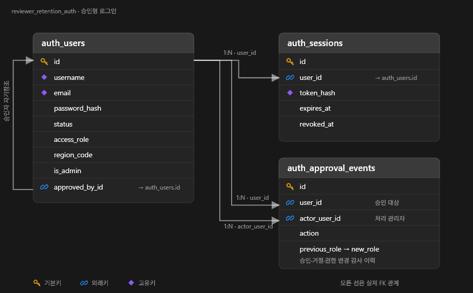
</p>

---

## 데이터 흐름 및 전처리

### 전체 데이터 흐름

<p align="center">
  
</p>

Yelp 원천 데이터에서 음식 관련 범위를 확정하고, 시점 안전 피처와 검증·운영 산출물을 생성한 뒤 MySQL·FastAPI·React로 연결합니다. React에서 저장한 관리자 판단·대상 명단·운영안은 다시 MySQL에 기록됩니다.

### 데이터 범위와 시간 분할

<p align="center">
  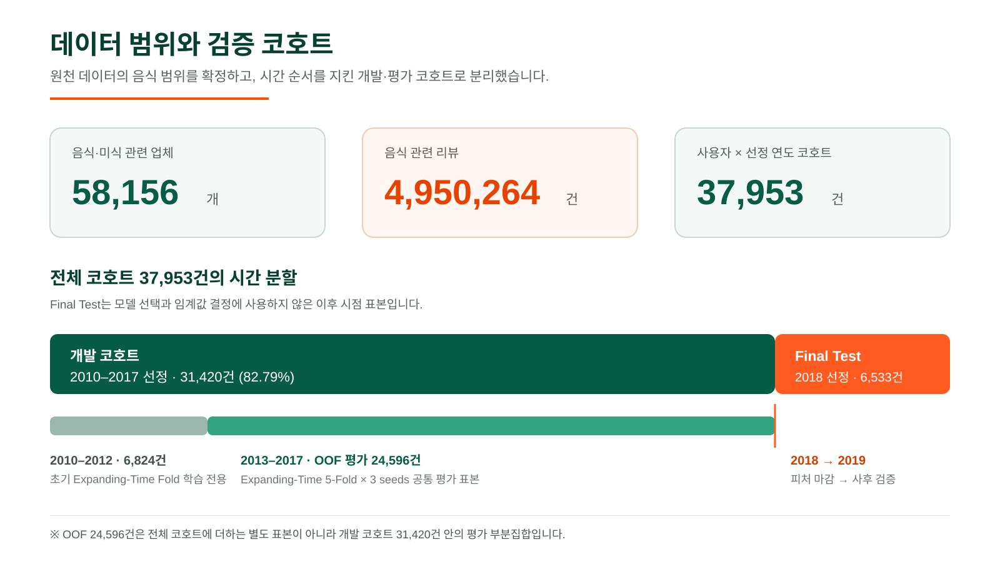
</p>

전체 37,953건은 개발 코호트 31,420건과 Final Test 6,533건으로 구성됩니다. OOF 24,596건은 별도 표본이 아니라 개발 코호트 중 2013~2017년 공통 평가 부분집합입니다.

### Final Test 상태 분포

<p align="center">
  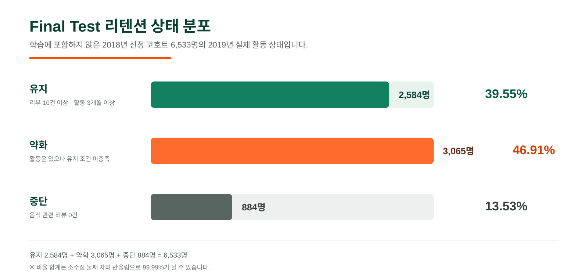
</p>

### EDA·데이터 조건과 전처리 반영

<p align="center">
  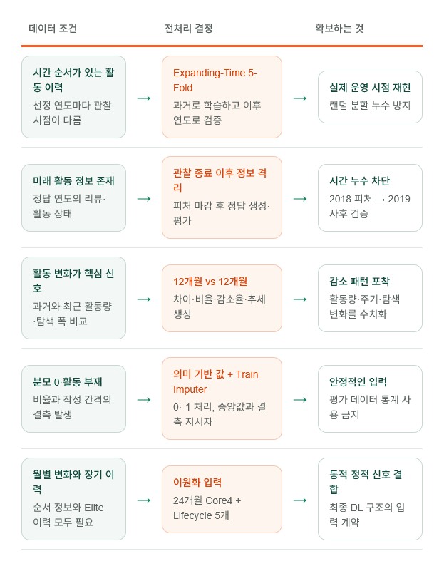
</p>

시간 순서를 보존한 검증, 예측 시점 이후 정보 격리, 활동 변화 피처와 의미 기반 결측 처리를 적용했습니다. DL 입력은 월별 변화와 장기 이력을 결합할 수 있도록 `24개월 × Core4` 시퀀스와 Lifecycle 5개 정적 피처로 분리했습니다.

### 피처 상관관계 검토

<p align="center">
  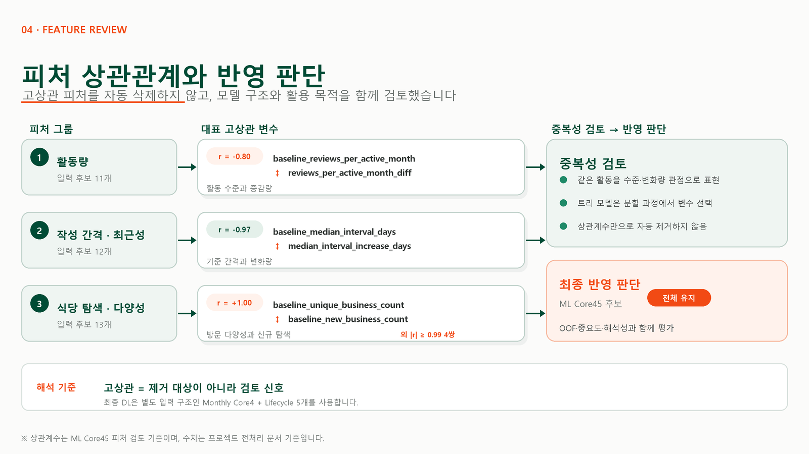
</p>

ML Core45에서는 고상관을 곧바로 제거 기준으로 사용하지 않고 OOF 성능·중요도·해석성을 함께 검토했습니다. 트리 기반 후보는 전체 피처를 유지해 비교했으며, 최종 DL은 이 검토와 별도로 `Monthly Core4 + Lifecycle 5개` 입력 구조를 사용합니다.

### 모델 입력 비교

<p align="center">
  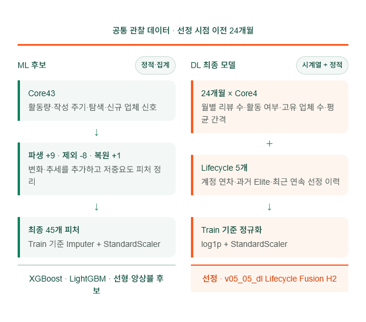
</p>

상세 피처와 처리 기준은 [데이터 전처리 결과서](docs/02_reports/01_data_preprocessing_report.md)를 참고하세요.

---

## 모델

### 문제 정의

선정 연도에 음식 관련 리뷰 10건 이상, 활동 월 3개월 이상인 파워 리뷰어를 대상으로 다음 연도 상태를 분류합니다.

| 클래스 | 다음 연도 조건 |
|---|---|
| 유지 `retained` | 리뷰 10건 이상 AND 활동 월 3개월 이상 |
| 약화 `weakened` | 리뷰 1건 이상이며 유지 조건 미충족 |
| 중단 `stopped` | 음식 관련 리뷰 0건 |

### `v05_05_dl` 구조

<p align="center">
  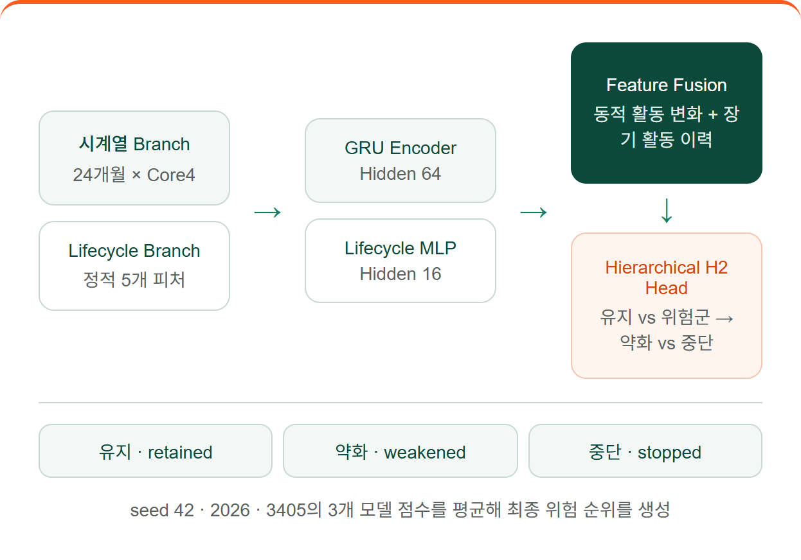
</p>

GRU가 24개월 활동 시퀀스를, Lifecycle MLP가 장기 이력을 인코딩합니다. 결합 표현은 유지와 위험군을 먼저 구분한 뒤 위험군을 약화와 중단으로 나누며, seed 42·2026·3405의 모델 점수를 평균해 최종 위험 순위를 생성합니다.

### 후보 모델 비교

동일한 OOF 표본 24,596건에서 ML·DL 후보를 비교했습니다.

<p align="center">
  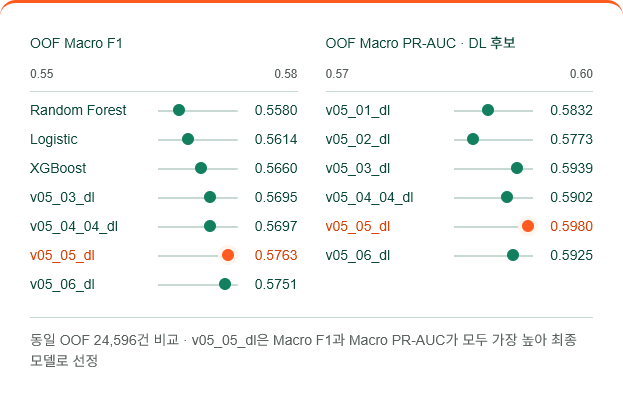
</p>

| 운영 지표 | `v05_05_dl` | `v05_06_dl` |
|---|---:|---:|
| Precision@1000 | **90.60%** | 90.04% |
| 중증 오분류 | **2.19% · 538건** | 2.64% · 650건 |

`v05_05_dl`은 Macro F1과 Macro PR-AUC가 모두 가장 높고 운영 지표도 더 안정적이어서 최종 모델로 선정했습니다.

### OOF 수락 기준

| 평가 지표 | 수락 기준 | 결과 | 판정 |
|---|---:|---:|---|
| Macro F1 | 0.5700 이상 | **0.5763** | PASS |
| Macro PR-AUC | 0.5900 이상 | **0.5980** | PASS |
| Precision@1000 | 90.0% 이상 | **90.60%** | PASS |
| 중증 오분류 | 2.5% 이하 | **2.19% · 538건** | PASS |

### Final Test

Final Test는 모델 선정에 사용하지 않은 2018년 선정 코호트로 수행했습니다. 가중치와 임계값은 OOF 검증까지만 사용해 고정했으며, 사전에 Final Test 합격 임계값을 확정하지 않았으므로 OOF 기준을 소급 적용해 PASS·FAIL로 판정하지 않습니다.

<p align="center">
  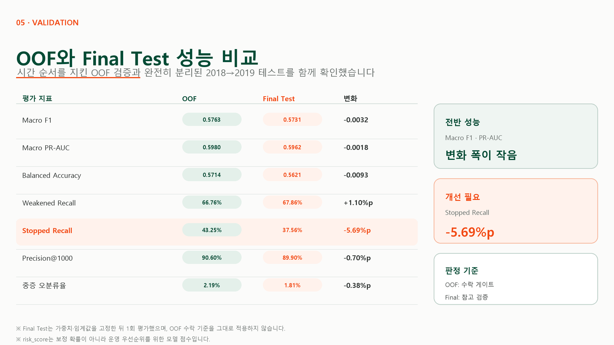
</p>

Macro F1과 Macro PR-AUC의 변화 폭은 작았지만, `Stopped Recall`은 43.25%에서 37.56%로 5.69%p 감소해 완전 중단 리뷰어 탐지에는 개선 여지가 있습니다. 중증 오분류율은 2.19%에서 1.81%로 낮아졌습니다.

| Final Test 운영 순위 지표 | 결과 |
|---|---:|
| Top 20% Precision | **89.29%** |
| Top 20% Recall | **29.55%** |
| Top 20% Lift | **1.48배** |

현재 `v05_05_dl`의 변수별 정량 중요도 산출물은 없습니다. 월별 시퀀스와 Lifecycle 특성은 모델 입력이지만 각 특성의 독립적인 인과 효과를 의미하지 않습니다.

---

## 화면 구성

<p align="center">
  
</p>

| 단계 | 화면 | 운영 질문 | 주요 기능 |
|---:|---|---|---|
| 1 | 콘텐츠 공급 위험 | 어디의 공급이 줄었나? | 권역·도시별 공급·핵심·신규 비교와 우선 지역 탐색 |
| 2 | 핵심 리뷰어 관리 | 누구를 먼저 검토하나? | 위험 유형·우선순위·판단 상태 필터와 상세 이동 |
| 3 | Reviewer 360 | 어떤 활동이 변했나? | 활동량·작성 주기·탐색·반경 근거와 관리자 판단 |
| 4 | 운영안 설계 | 어떤 운영안을 저장할까? | 개인 특별 관리와 지역 활성화 운영안 저장 |
| 5 | 운영 결과·알림 | 언제 다시 확인할까? | 판단·명단·운영안·접촉·감사·재검토 이력 |

---

## 업무 흐름

<p align="center">
  
</p>

- **Track A · 개인 리뷰어 운영:** 핵심 리뷰어 선택 → Reviewer 360 근거·판단 → 개인 특별 관리안 저장
- **Track B · 지역 활성화 운영:** 권역·도시 선택 → CRM 후보·위험 신호 확인 → 추천 음식점·후원 후보 검토 → 지역 운영안 저장

저장된 판단, 대상 명단과 운영안은 운영 이력에서 다시 확인하며 수동 재검토를 통해 다음 운영 주기로 연결합니다. 외부 CRM 발송과 실제 성과 수집은 현재 연동하지 않습니다.

---

## 실행 가이드

### 1. 사전 준비

- Python 3.12, Node.js, MySQL을 준비합니다.
- 분석·운영 DB `yelp_data`와 인증 DB `reviewer_retention_auth`를 분리해 구성합니다.
- `database/.env`와 `auth_service/.env`를 각 예시 파일에 맞춰 작성합니다.
- DB DDL·적재 절차는 [database/README.md](database/README.md)를 따릅니다.

```powershell
python -m venv venv
.\venv\Scripts\Activate.ps1
python -m pip install --upgrade pip
python -m pip install -r requirements.txt -r api\requirements.txt -r auth_service\requirements.txt

cd app
npm install
cd ..
```

모델을 재학습하려면 DL 의존성을 추가로 설치합니다.

```powershell
python -m pip install -r requirements-dl.txt
```

### 2. 서비스 실행

각 명령을 프로젝트 루트의 별도 터미널에서 실행합니다.

```powershell
# 분석·운영 API — http://127.0.0.1:8000
python -m uvicorn api.main:app --reload --port 8000

# 인증 서비스 — http://127.0.0.1:8100
python -m uvicorn auth_service.main:app --reload --port 8100

# React — http://localhost:5173
cd app
npm run dev
```

Windows에서는 `RUN_LOCAL.cmd`로 로컬 서비스를 함께 시작할 수 있습니다. 최초 관리자 생성과 상세 환경 설정은 [로컬 실행 가이드](docs/04_architecture_and_guides/LOCAL_RUN_GUIDE.md)를 참고하세요.

### 3. 기본 검증

```powershell
python -m compileall -q api auth_service shared
python -m unittest tests.test_demo_contract tests.test_historical_metric_loaders tests.test_reference_data_seed
python -m pytest auth_service/tests -q

cd app
npm run lint
npm run build
```

---

## 모델 재생성

최종 가중치와 전처리 객체는 `.gitignore` 대상인 `models/experiments/v05_05_dl/`에 생성됩니다. 승인된 별도 보관 위치에서 전달받거나 아래 절차로 재생성해야 합니다.

```powershell
python pipeline/v05_05_dl/train.py
python pipeline/v05_05_dl/evaluate_test.py
```

| 산출물 | 경로 |
|---|---|
| 3-seed 가중치 | `models/experiments/v05_05_dl/seed_{42,2026,3405}_state_dict.pt` |
| 전처리 객체 | `models/experiments/v05_05_dl/preprocessing.joblib` |
| 모델 메타데이터 | `models/experiments/v05_05_dl/metadata.json` |
| Final Test 예측 프로필 | `data/processed/predictions/test_retention_profiles_v05_05_dl.parquet` |
| 평가 결과 | `reports/experiments/v05_05_dl/` |

---

## 현재 검증·배포 상태

서비스 접속과 `v05_05_dl` 연동은 확인됐지만 최종 운영 승인은 보류 상태입니다.

| 검증 | 결과 |
|---|---|
| React lint / build | PASS |
| 배포 워크플로 단위 테스트 | 9건 PASS |
| v05 운영 컨텍스트·UI·모델 로더 계약 | 19건 PASS |
| 인증 서비스 테스트 | 문서 기준 4건 PASS · 1건 FAIL |
| 관리자 UI 전체 QA | 135건 중 PASS 95 · FAIL 17 · PARTIAL 6 · NOT RUN 17 |
| 서비스 배포 | 완료 — 운영 주소 접속 가능 |
| v05 모델 서비스 연동 | 완료 — `v05_05_dl` 운영 표시 확인 |
| 최종 배포 승인 | **보류** |

주요 배포 차단 항목은 비인증 API 접근, 운영자 권역 정책 우회, HTTPS 미적용, 스누즈 복원 실패, 배포 식별자 부재와 미완료 회귀입니다. 상세 근거는 [모델 배포·테스트 결과서](docs/02_reports/03_model_deployment_test_report.md)와 [QA 실행 결과](docs/qa/ADMIN_UI_QA_EXECUTION_2026-08-05.md)에 기록했습니다.

---

## 트러블슈팅

| 증상 | 확인·해결 방법 |
|---|---|
| PowerShell에서 `npm` 실행 정책 오류 | `npm.cmd install`, `npm.cmd run dev`, `npm.cmd run build` 형태로 실행 |
| React 화면에 데이터가 표시되지 않음 | FastAPI `http://127.0.0.1:8000/health`와 MySQL 연결을 먼저 확인. 현재 React에는 API 실패 시 정적 JSON 자동 폴백이 없음 |
| 인증 후 다시 로그인 화면으로 이동 | 인증 서비스 8100 포트, 쿠키·CORS·CSRF 환경값과 프런트 API URL을 함께 확인 |
| MySQL 테이블 또는 데이터가 없음 | `database/README.md`의 DDL→적재→검증 순서를 다시 실행하고 DB 이름을 확인 |
| 모델 파일을 찾을 수 없음 | `models/`는 Git에 포함되지 않으므로 승인된 위치에서 받거나 모델 재생성 절차 수행 |
| 포트가 이미 사용 중임 | 5173·8000·8100 포트의 기존 프로세스를 확인한 후 종료하거나 실행 포트를 변경 |

상세 환경 변수와 실행 순서는 [로컬 실행 가이드](docs/04_architecture_and_guides/LOCAL_RUN_GUIDE.md)를 참고하세요.

---

## 향후 개선 방향

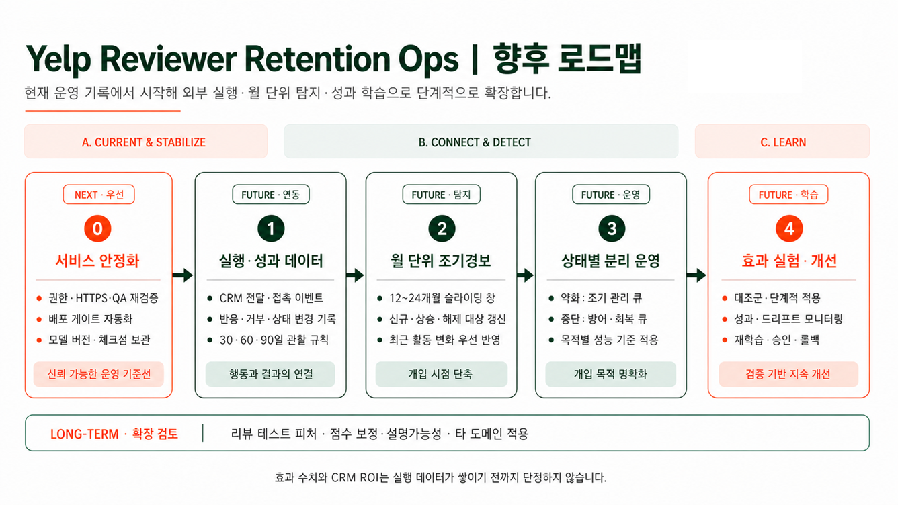

현재는 기능 확장보다 운영 기준선을 안정화하는 작업을 우선합니다.

- 비인증 API 접근, 권역 우회, HTTPS와 스누즈 영속성 등 P0 결함 수정
- 동일 배포본 기준 전체 QA 재실행과 배포 게이트 자동화
- 모델 가중치·메타데이터의 공식 보관 위치, 체크섬과 버전 정책 확정
- 모바일 `/trust` 가로 넘침과 접근 가능한 이름 등 반응형·접근성 보완

이후 실행·성과 데이터 계약, 월 단위 조기경보, 약화·중단 상태별 운영, 효과 실험과 지속 개선 순으로 확장합니다. 단계별 목표와 완료 기준은 [서비스 제품화 및 적용 로드맵](docs/08_future_roadmap/06_service_productization_and_application.md)에서 확인할 수 있습니다.

---

## 문서

| 문서 | 설명 |
|---|---|
| [프로젝트 요구사항 명세서](docs/01_business/project_requirements.md) | 범위, 요구사항, 수락 기준, QA·배포 게이트 |
| [WBS](docs/01_business/WBS.md) | 역할, 일정, 선행 관계, 산출물과 현재 상태 |
| [데이터 전처리 결과서](docs/02_reports/01_data_preprocessing_report.md) | 코호트·결측·피처·시간 분할·전처리 검증 |
| [모델 학습 결과서](docs/02_reports/02_model_training_report.md) | 후보 비교, `v05_05_dl`, OOF·Final Test, 산출물 계약 |
| [모델 배포·테스트 결과서](docs/02_reports/03_model_deployment_test_report.md) | 정적 검증, 운영 선택 재검증, 배포 게이트 판정 |
| [비즈니스 시나리오](docs/01_business/business_scenarios.md) | 운영 문제와 활용 시나리오 |
| [로컬 실행 가이드](docs/04_architecture_and_guides/LOCAL_RUN_GUIDE.md) | MySQL·API·인증·React 실행 절차 |
| [AWS 배포 가이드](docs/04_architecture_and_guides/AWS_DEPLOYMENT.md) | 배포 구성과 운영 절차 |
| [QA 케이스](docs/qa/ADMIN_UI_QA_CASES.md) | 관리자 UI 135개 테스트 시나리오 |
| [QA 실행 결과](docs/qa/ADMIN_UI_QA_EXECUTION_2026-08-05.md) | PASS·FAIL·미실행 결과와 결함 |
| [의사결정 기록](docs/06_decisions/) | 데이터·코호트·모델·운영 정책 결정 |

---

## 범위와 한계

- 모델 점수는 확률이나 의학적 진단이 아닌 상대적 운영 우선순위입니다.
- 리뷰 활동 위치를 거주지·직장·실제 생활 반경으로 해석하지 않습니다.
- 운영안은 검증된 처방이 아니라 운영자가 검토할 가설입니다.
- 이메일·푸시·쿠폰·혜택 제공과 실제 CRM 발송은 구현 범위에서 제외합니다.
- 캠페인 성과는 실제 실행·성과 데이터가 없어 인과 효과를 보장하지 않습니다.
- 외부 CRM 발송·성과 수집 미연동 상태이므로 재검토는 현재 수동 운영입니다.
- v04 산출물과 이전 Streamlit 앱은 비교·롤백·이력 확인 목적으로만 보존합니다.

---

## 회고

### 잘한 점

- 랜덤 분할 대신 선정 연도 기준 Expanding-Time 검증과 분리된 Final Test를 사용해 시간 누수를 통제했습니다.
- 분석 결과를 대시보드에서 끝내지 않고 탐지→선택→판단→운영안 저장→재검토의 운영 흐름으로 연결했습니다.
- 모델 점수, 공간 정보와 운영안의 한계를 문서와 화면에서 명확히 구분했습니다.

### 아쉬웠던 점

- 통합 QA와 보안·권한 검증이 프로젝트 후반에 집중돼 P0 결함을 수정하고 전체 회귀할 시간이 부족했습니다.
- 최종 모델 산출물의 공식 보관 위치와 체크섬·버전 정책을 개발 초기에 확정하지 못했습니다.
- 요구사항, QA와 결과서가 병렬로 갱신되면서 일부 상태와 테스트 결과의 최종 동기화가 필요해졌습니다.

### 다음 프로젝트에서 개선할 점

- 요구사항 수락 기준과 배포 게이트를 개발 시작 시점부터 자동 테스트와 연결합니다.
- 모델·DB·API·UI 산출물의 버전과 소유자를 하나의 릴리스 체크리스트로 관리합니다.
- 주요 사용자 흐름과 권한 경계를 기능 구현과 동시에 반복 검증하고, 마지막 날에는 신규 기능보다 전체 회귀에 집중합니다.

---

<div align="center">

### 모델이 답을 대신하는 서비스가 아니라, 운영자가 더 좋은 판단을 내리게 하는 서비스

`데이터로 발견하고 · 근거로 판단하고 · 운영 기록으로 연결합니다.`

Yelp Open Dataset 기반 비상업 분석 프로젝트이며 Yelp의 공식 서비스가 아닙니다.

</div>
