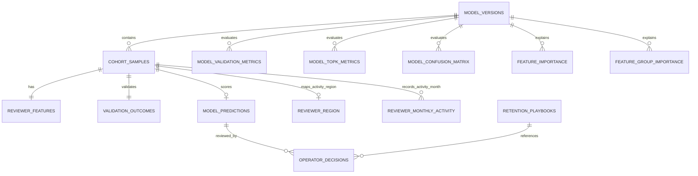

# Yelp Reviewer Retention v04 MySQL ERD

## 데이터 계보

```text
culinary_rolling_cohort_master_v04.parquet (37,953)
    ├─ cohort_samples
    └─ validation_outcomes

modeling_dataset_rolling_v04.parquet (37,953, Core 43)
    └─ reviewer_features

final_test_retention_profiles_v04.parquet (6,533)
    └─ model_predictions

reviewer_region_v04.parquet (6,533)
    └─ reviewer_region

reviewer_monthly_activity_v04.parquet
    └─ reviewer_monthly_activity

final_core_logistic_multiclass_metadata_v04.json
    └─ model_versions

reports/tables/*_v04.csv
    └─ 모델 평가·피처 중요도 테이블
```

## 관계



## 키

- 모델: `model_version`
- 사용자-연도 표본: `model_version + sample_id`
- 관리자 판단: `decision_id`
- `user_id`는 동일 사용자의 연도별 표본이 존재하므로 단독 PK가 아니다.
- Yelp ID는 대소문자를 구분하도록 `ascii_bin` collation을 사용한다.

## 시간 누수 방지

`validation_outcomes`는 사후 검증 전용이다. 다음 컬럼은
`vw_reviewer_work_queue`에 포함하지 않는다.

```text
target_review_count
target_active_months
retention_state
churn
```

실제 결과가 필요한 분석가는 `vw_reviewer_validation`을 명시적으로 조회한다.

## v04 기준값

| 항목 | 값 |
|---|---:|
| 전체 코호트 | 37,953 |
| Test 표본 | 6,533 |
| Core 피처 | 43 |
| 유지 | 2,584 |
| 약화 | 3,065 |
| 중단 | 884 |
| Top 20% | 1,307 |
| 비교 활동 없음 | 1,692 |
