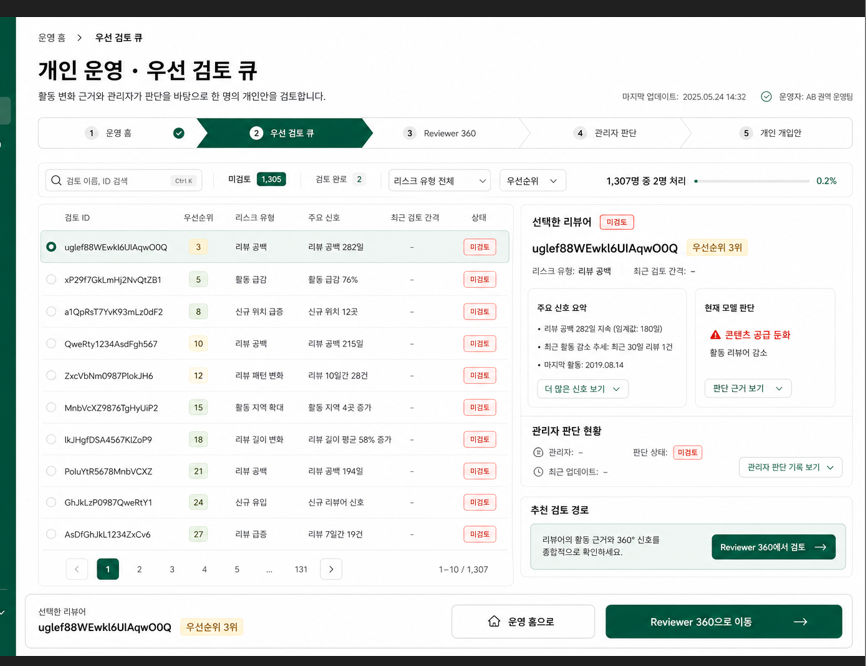
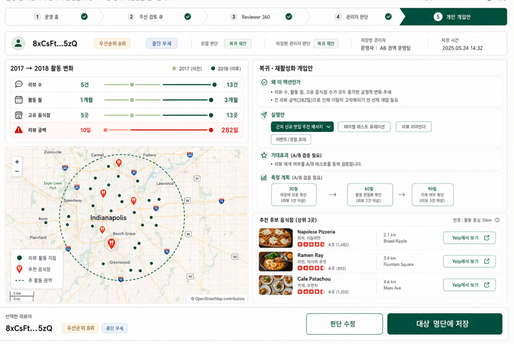
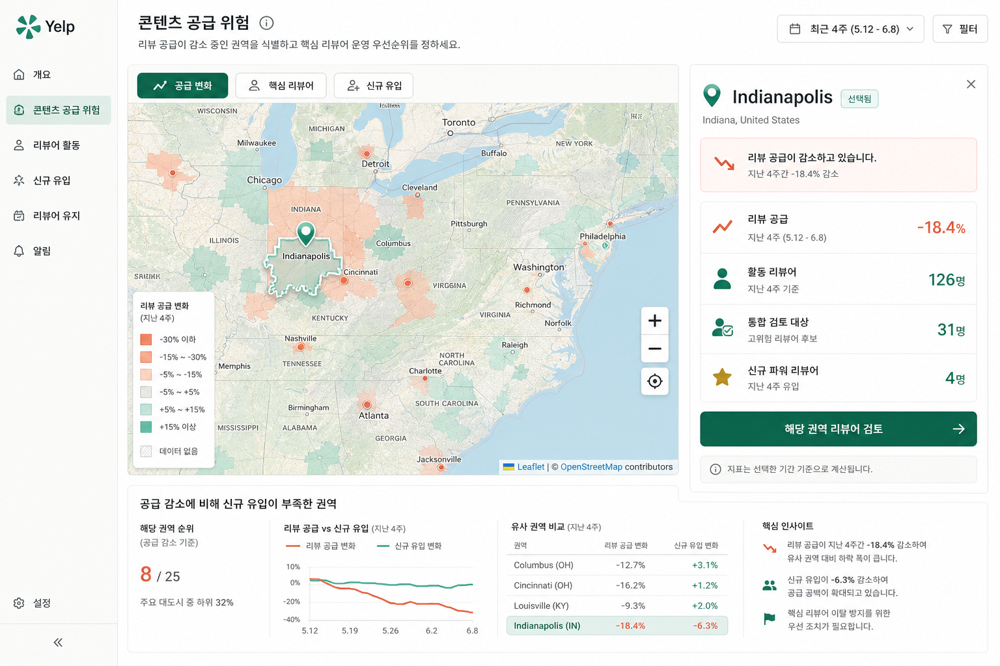
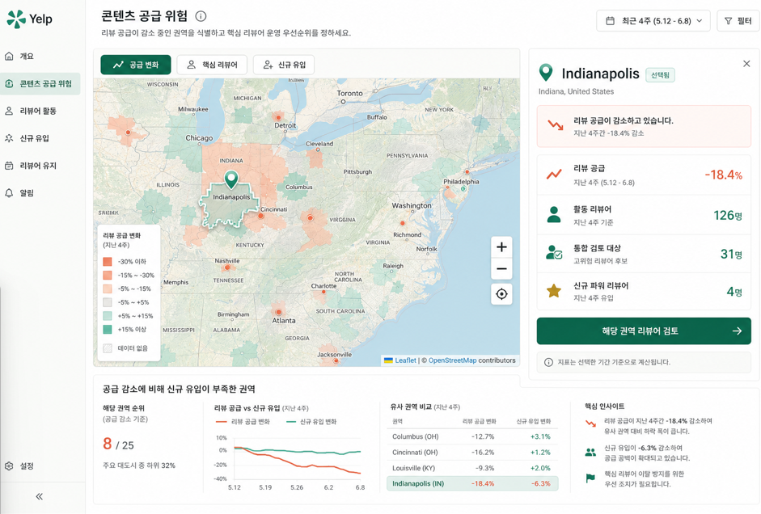

# v05 최종 제품 UX 실행 명세

> **문서 상태: 현재 기준**
> 최종 화면 정보 구조와 제품 표현에 적용한다.

## 0. 문서 권한과 사용법

이 문서는 v05 최종 발표 버전의 **화면 구현 단일 기준**이다. 제품 방향은
[DEC-012](../06_decisions/DEC-012_review_supply_recovery_operating_flow.md)를 따르고,
데이터·모델 보호 원칙은 루트 `AGENTS.md`를 따른다.

충돌 시 우선순위:

1. `AGENTS.md`
2. `docs/06_decisions/`
3. `docs/07_history_and_handoff/CODEX_HANDOFF.md`
4. 본 문서
5. `V05_WORK_SPEC.md`, `V05_UPGRADE_EXPLORATION.md` 및 기타 UI 문서

채팅 기억이나 임의의 디자인 해석보다 본 문서가 우선한다. 명세와 실제 데이터가
충돌하면 가짜 화면을 만들지 말고 사용자에게 확인한다.

---

## 1. 제품 한 줄 정의

> 지역별 리뷰 공급 변화를 감지하고 원인을 분석한 뒤, 핵심 리뷰어 특별 관리 또는
> 지역 활성화 캠페인으로 연결하는 리뷰 생태계 운영 서비스.

## 2. 핵심 사용자와 질문

주요 사용자는 콘텐츠·커뮤니티 운영자와 리뷰어 CRM 담당자다.

| 단계 | 운영자가 답해야 하는 질문 |
|---|---|
| 감지 | 어느 권역의 리뷰 공급이 둔화됐는가? |
| 원인 | 활동 리뷰어, 핵심 리뷰어, 신규 유입 중 무엇이 원인인가? |
| 대상 | 어떤 리뷰어와 음식점을 먼저 검토해야 하는가? |
| 대응 | 개인 특별 관리와 지역 캠페인 중 무엇을 실행할 것인가? |
| 측정 | 30·60·90일 동안 어떤 지표를 관찰할 것인가? |

## 3. 최종 사이드바와 경로

| 순서 | 메뉴 | 경로 | 역할 |
|---:|---|---|---|
| 1 | 개요 | `/` | 공급 위험과 오늘의 우선 조치 요약 |
| 2 | 콘텐츠 공급 위험 | `/regional` | 권역 선택과 원인 분석 |
| 3 | 핵심 리뷰어 관리 | `/reviewers?mode=individual&status=미검토&sort=우선순위` | 우선 검토 큐 |
| 4 | 신규 파워 유입 | `/regional?layer=newcomers` | 권역별 신규 유입 분석 |
| 5 | 지역 활성화 캠페인 | `/playbook?mode=region` | 지역 이벤트·콘텐츠 캠페인 |
| 6 | 개인 특별 관리안 | `/playbook?mode=individual` | 실행안·채널·콘텐츠 선택 |
| 7 | 운영 결과·알림 | 향후 확정 | 저장 이력과 재검토 시점 |
| 8 | 운영 신뢰 | `/trust` | 모델·데이터 검증과 한계 |
| 9 | 설정 | 인증 관리자 화면 또는 향후 확정 | 사용자·권한·운영 설정 |

`/regional/home`, `/individual/home`은 호환 경로로 유지하되 사이드바에서 중복 노출하지
않는다. `Reviewer 360`은 핵심 리뷰어 관리에서 선택한 대상의 상세 화면이므로 별도
최상위 메뉴로 중복 노출하지 않는 것을 기본으로 한다.

## 4. 공통 디자인 계약

### 4.1 유지

- 공식 Yelp 로고와 흰색 사이드바
- 흰색 바탕, 짙은 초록 선택·실행, 산호색 위험·감소
- 얇은 회색 구분선과 고밀도 운영 콘솔 레이아웃
- 화살표형 업무 스테퍼
- 실제 음식점 사진, Yelp Open Dataset 별점, 실제 지도
- 하단 고정 행동 바

### 4.2 금지

- 짙은 초록색 전체 사이드바
- 마케팅 랜딩 페이지처럼 큰 히어로가 화면 대부분을 차지하는 구조
- 같은 크기와 무게의 카드 반복
- 작동하지 않는 버튼을 활성 상태로 표시
- 구현되지 않은 기능을 배지로 선공개
- 데이터에 없는 `최근 4주`, 주간 추이, 효과 수치 생성
- 설명 문장을 수치·상태·행동보다 먼저 강조

### 4.3 데스크톱 기준

- 우선 검수 해상도: 1440×900
- 핵심 제목, 현재 상태, 주요 데이터, Primary CTA가 첫 화면에 보여야 한다.
- 지도 화면: 지도 약 65%, 선택 상세 패널 약 35%
- 목록 화면: 테이블 약 60~65%, 선택 패널 약 35~40%
- 가로 스크롤은 작은 화면의 표에서만 허용한다.
- 모바일·작은 화면에서는 주요 패널을 세로로 재배치하되 기능을 숨기지 않는다.

## 5. 데이터 표시 계약

| 항목 | 실제 기준 | 금지 표현 |
|---|---|---|
| 코호트 | Test 6,533명 | 전체 Yelp 사용자로 표현 |
| CRM 검토 대상 | 통합 우선순위 상위 20%, 1,307명 | 이탈 확률 상위 20% |
| 시간 | 비교 2017 → 선정 2018 → 검증 2019 | 최근 4주·실시간 |
| 권역 | state 단위 리뷰 활동 집계 | 거주 지역 |
| 공급 변화 | API의 `reviewSupplyChangeRate` | 임의 감소율 |
| 신규 유입 | `newPowerReviewers` 파생 결과 | 신규 가입자 수 |
| 모델 점수 | 위험 순위 지표 | 이탈 가능성 n% |
| 개입 효과 | 검증할 운영 가설 | 예상 복귀율·확정 증가율 |

사후 검증 2019 정보는 기본 숨김 상태를 유지하며, 운영 당시 알 수 없었던 결과임을
명시한다.

---

## 6. 화면 계약

### 6.1 개요 `/`

#### 목적

운영자가 첫 화면에서 어느 권역 또는 리뷰어를 먼저 검토할지 결정한다.

#### 레이아웃

1. 상단: `리뷰어 리텐션 운영 개요`, 데이터 기준 시점, 필터, 마지막 갱신 상태
2. 중앙 왼쪽: 공급 변화 지도와 `공급 변화 / 핵심 리뷰어 / 신규 유입` 탭
3. 중앙 오른쪽: 선택 권역 또는 오늘의 우선 조치 패널
4. 하단: 권역 비교, 큐 진행률, 실제 데이터 기반 핵심 인사이트

#### 반드시 표시

- 리뷰 공급 우선 확인 권역
- 리뷰 공급 변화율
- 활동 리뷰어 수
- CRM 검토 후보 수
- 신규 핵심 리뷰어 수
- 오늘의 미검토 수와 판단 완료 수

#### 주요 행동

- Primary: 선택 권역 원인 분석 또는 최우선 리뷰어 검토
- Secondary: 전체 공급 위험 지도, 전체 우선 검토 큐

#### 금지

- 대형 마케팅 히어로
- 실제 시계열 없이 그린 주간 라인 차트
- 권역과 개인 운영을 서로 무관한 제품 카드로만 분리

#### 완료 조건

- 1440×900에서 지도, 우선 패널, Primary CTA가 동시에 보인다.
- 선택 권역 변경 시 오른쪽 패널이 같은 데이터 기준으로 갱신된다.
- 권역과 개인 대응 경로가 CTA로 연결된다.

### 6.2 콘텐츠 공급 위험 `/regional`

#### 목적

리뷰 공급이 감소·둔화된 권역을 찾고 원인을 분석한다.

#### 지도 탭

- 공급 변화
- 핵심 리뷰어
- 신규 유입

#### 지도 계약

- state·province 경계를 GeoJSON 영역으로 표시한다.
- 공급 감소는 산호색, 증가는 민트색, 데이터 없음은 중립·사선 패턴으로 표시한다.
- 선택 권역은 흰색 굵은 외곽선과 대표 활동 도시 핀으로 강조한다.
- 권역 위험을 초록 원형 버블만으로 표현하지 않는다.
- 범례는 지도 안쪽 하단에 표시한다.

#### 오른쪽 선택 패널

- 권역명과 대표 활동 도시
- 리뷰 공급 변화
- 활동 리뷰어
- CRM 통합 검토 대상
- 신규 핵심 리뷰어
- 데이터 기반 원인 요약

#### 하단 분석

- 공급 변화 기준 권역 순위
- 현재 가능한 기간 기준 공급·활동 리뷰어·신규 유입 비교
- 유사 권역 표
- 핵심 인사이트

주간 시계열이 없으면 전년 비교 막대·표를 사용한다.

#### 주요 행동

- `해당 권역 리뷰어 검토`
- `지역 활성화 캠페인 설계`

#### 상태

- 선택 전: 가장 우선인 실제 권역을 기본 선택
- 선택 후: 지도 경계와 패널 동시 강조
- 파생 없음: `분석 데이터 없음`과 필요한 파생명을 명시
- 지도 경계 없음: 점 지도 폴백 여부를 사용자와 먼저 결정

### 6.3 핵심 리뷰어 관리 `/reviewers`

#### 목적

누구를 먼저 Reviewer 360에서 검토할지 결정한다.

#### 레이아웃

- 상단 한 줄: 검색, 미검토·완료 수, 위험 유형, 우선순위, 진행률
- 왼쪽: 10행 고밀도 테이블과 페이지네이션
- 오른쪽: 선택 리뷰어 요약 패널
- 하단: 선택 대상과 Reviewer 360 이동 행동 바

#### 테이블 열

- 리뷰어 ID
- 우선순위
- 위험 유형
- 주요 신호
- 최근 검토 간격 또는 최근 리뷰 공백
- 관리자 판단 상태

#### 오른쪽 패널

- 선택 리뷰어 ID와 우선순위
- 주요 신호 요약
- 현재 모델 판단
- 관리자 판단 현황과 최근 갱신
- 추천 검토 경로

#### 상호작용

- 행 선택 시 오른쪽 패널 갱신
- 페이지당 10명 기본
- URL 필터·정렬·페이지 상태 유지
- Reviewer 360 이동

#### 금지

- 큐에서 근거 확인 없이 관리자 판단을 최종 저장하는 기본 흐름
- 100명을 한 번에 긴 목록으로 노출
- 모델 판단을 관리자 판단처럼 표현

### 6.4 Reviewer 360 `/reviewers/:reviewerId`

#### 목적

한 명의 활동 변화와 근거를 검토하고 관리자 판단을 저장한다.

#### 레이아웃

1. 경로·제목·업데이트 상태
2. 5단계 스테퍼
3. 리뷰어 ID·우선순위·모델 판단·관리자 판단 요약 바
4. 왼쪽: 활동 변화 지표와 실제 지도
5. 오른쪽: 관리자 판단
6. 지도 업무 탭: `활동 근거 / 추천 후보 / 반경 비교`
7. 하단: 큐로 돌아가기 / 판단 저장 / 개인 특별 관리안 이동

#### 지도 의미

- 리뷰 활동 지점은 작은 원형 점
- 추천 음식점은 산호색 식기 핀
- 선택 음식점은 사진·별점·주소·운영 속성과 Yelp 검색 링크 표시
- 공개 음식점 위치이며 거주지·이동 경로가 아님을 명시

#### 관리자 판단

- 리뷰 다시 시작 유도
- 리뷰 활동 늘리기
- 변화 지켜보기
- 이번엔 제외

판단·메모·스누즈·접촉 이력은 기존 서버 저장 계약을 유지한다.

### 6.5 개인 특별 관리안 `/playbook?mode=individual&reviewer=...`

#### 목적

관리자 판단을 실제 운영 가설과 측정 계획으로 구체화한다.

#### 선택 계약

- 핵심 실행안: 단일 선택
- 전달 채널: 복수 선택
- 음식점·콘텐츠 후보: 복수 선택
- 선택 변경 시 `왜 이 액션인가 / 기대효과 / 측정 계획` 갱신

#### 실행안 후보

| 위험 유형 | 우선 검토 실행안 |
|---|---|
| 활동량 붕괴형 | 저부담 사진·한줄 리뷰 제안, 리뷰 리마인더, 복귀 메시지 |
| 작성 주기 이완형 | 신규 맛집 큐레이션, 주기적 리마인더 |
| 탐색 활동 축소형 | 미방문 음식점, 새로운 카테고리, 지역 이벤트 |
| 복합 위험형 | 운영자 직접 확인, 간단 선호 조사, 단계적 개입 |
| 일반 모니터링형 | 변화 관찰, 개입 제외 |

#### 채널 후보

- 앱 메시지
- 푸시
- 이메일
- 운영자 직접 접촉

실제 발송은 현재 범위가 아니며 수신 동의 데이터가 없으면 발송 가능한 것처럼 표현하지
않는다.

#### 저장 계약

현재 `target_lists`는 이름·판단·모델 버전·리뷰어만 저장한다. 실행안·채널·콘텐츠
선택을 영구 저장하려면 별도 DB/API 계약이 필요하다. 해당 계약 전에는 `임시 구성`으로
표시하며 저장 완료를 가장하지 않는다.

#### 측정 계획

- 30일: 리뷰 재개 여부
- 60일: 활동 월·리뷰 수 변화
- 90일: 지속 여부·신규 음식점 리뷰

효과 수치는 사전에 단정하지 않는다.

### 6.6 지역 활성화 캠페인 `/playbook?mode=region&region=...`

#### 목적

권역 원인 분석 결과를 리뷰어 대상과 음식점·이벤트 콘텐츠로 연결한다.

#### 레이아웃

- 왼쪽: 실제 지도, 캠페인 반경, 음식점 후보
- 오른쪽 상단: 권역 운영 요약
- 오른쪽 본문: 사진·별점·리뷰 수가 있는 음식점 후보 목록
- 하단: 대상 리뷰어 수, 선택 음식점 수, 이전·다음·저장

#### 이벤트·콘텐츠 가설

- 지역 신규 맛집 탐방 이벤트
- 특정 카테고리 리뷰 챌린지
- 사진 리뷰 참여 이벤트
- 신규 음식점 큐레이션
- 휴면 핵심 리뷰어 지역 초대
- 지역별 테마 리스트 제작
- 콘텐츠 공급 부족 카테고리 집중 캠페인

#### 저장

- 현재는 운영 검토 대상 명단 저장이며 발송이 아니다.
- 이벤트 유형·콘텐츠 선택의 영구 저장은 서버 계약 확인 후 구현한다.

### 6.7 운영 신뢰 `/trust`

#### 목적

모델이 무엇을 예측하고 어떤 데이터·운영 한계를 갖는지 설명한다.

#### 반드시 유지

- 클래스 점수는 확률이 아님
- 통합 우선순위 정책
- 시간 분할과 사후 Test 검증
- 용량·정밀도·재현율·Lift
- 지리 정보와 추천의 한계
- 개입·캠페인은 검증된 처방이 아님

---

## 7. 상호작용과 저장 매트릭스

| 기능 | 현재 저장 | 최종 요구 | 처리 원칙 |
|---|---|---|---|
| 관리자 판단·메모 | 서버 | 유지 | 기존 API 재사용 |
| 스누즈 | 서버 | 유지 | 기존 API 재사용 |
| 접촉 이력 | 서버 | 유지 | append log 유지 |
| 대상 명단 | 서버 | 유지 | 실제 발송 아님 |
| 개인 실행안 선택 | 미지원 | 서버 저장 필요 | 계약 전 임시 구성 표시 |
| 채널 선택 | 미지원 | 서버 저장 필요 | 수신 동의 확인 전 발송 금지 |
| 지역 이벤트 유형 | 미지원 | 서버 저장 필요 | 운영 가설로만 표시 |
| 캠페인 음식점 선택 | 화면 상태 | 서버 저장 검토 | 새로고침 보존 여부 명시 |

새로운 저장 기능이 필요하면 프론트에서 localStorage로 우회하지 않는다. DB/API 계약과
로그인 운영자 식별자를 먼저 확정한다.

## 8. 참고 이미지 적용 계약

### 8.1 우선 검토 큐



적용:

- 10행 고밀도 테이블
- 오른쪽 선택 리뷰어 요약
- 상단 필터·진행률 한 줄
- 하단 Reviewer 360 이동 행동 바

미적용:

- 짙은 초록색 사이드바
- 가짜 리뷰어·수치

### 8.2 개인 특별 관리안



적용:

- 활동 변화, 지도, 액션 플랜의 좌우 정렬
- 실행안 선택, 기대효과, 측정 계획
- 실제 음식점 사진·별점·거리

미적용:

- 데이터에 없는 기대효과 수치
- 현재 API가 저장하지 못하는 상태를 저장 완료로 표현

### 8.3 콘텐츠 공급 위험 지도



적용:

- 행정구역 영역 색칠
- 선택 권역 외곽선과 대표 도시 핀
- 오른쪽 선택 상세 패널
- 지도 범례와 하단 원인 분석

미적용:

- 실제 데이터에 없는 최근 4주 수치·주간 추이

### 8.4 전체 셸과 메인 화면



적용:

- 흰색 사이드바와 짧은 업무 메뉴
- 지도 중심 운영 콘솔
- 제목·기간·필터의 얇은 상단 구조
- 첫 화면에서 보이는 우선 조치

미적용:

- 프로젝트 정의와 맞지 않는 메뉴명
- 별도 API가 필요한 알림을 구현된 것처럼 표시

## 9. 구현 순서

1. 최종 사이드바·경로와 `/` 운영 개요
2. 권역 GeoJSON 영역 색칠 지도와 선택 패널
3. 우선 검토 큐 10행·페이지네이션·요약 패널
4. Reviewer 360 레이아웃 정리
5. 개인 실행안 선택 UI와 저장 계약 분리
6. 지역 이벤트·콘텐츠 캠페인 선택 UI
7. 운영 신뢰·용어·접근성·발표 화면 QA

각 화면을 완료한 뒤 다음 화면으로 이동한다. 여러 화면을 부분적으로 동시에 바꾸지 않는다.

## 10. Definition of Done

모든 화면은 아래 조건을 충족해야 완료다.

- [ ] 실제 API·DB 데이터만 사용한다.
- [ ] 로딩·빈 데이터·오류·선택·저장 완료 상태가 존재한다.
- [ ] 1440×900에서 핵심 CTA가 보인다.
- [ ] 가로 페이지 오버플로가 없다.
- [ ] 지도와 선택 상세가 같은 상태를 가리킨다.
- [ ] 모델 판단과 관리자 판단이 시각적으로 구분된다.
- [ ] 미구현 기능이 활성 버튼으로 보이지 않는다.
- [ ] 새로고침 후 보존되는 상태와 임시 상태가 구분된다.
- [ ] `npm run lint`와 `npm run build`가 통과한다.
- [ ] 로그인 상태에서 기본·선택·저장 경로를 브라우저로 검증한다.
- [ ] `database/`, `pipeline/` 등 팀원 소유 영역을 승인 없이 수정하지 않는다.

## 11. 사용량 절약을 위한 작업 규칙

1. 채팅 기억이 아니라 본 문서를 읽고 작업한다.
2. 구현 전 대상 파일과 기존 API 필드를 확인한다.
3. 화면 하나를 완성하고 브라우저에서 확인한 뒤 다음 화면으로 이동한다.
4. 참고 이미지와 다른 판단이 필요하면 코드를 쓰기 전에 사용자에게 알린다.
5. 데이터가 없으면 가짜 수치를 만들지 않고 `데이터 없음` 또는 차단 사항으로 기록한다.
6. 같은 화면의 새 시안을 반복 생성하지 않는다. 참고 이미지와 완료 조건을 사용한다.
7. lint·build는 작은 CSS 수정마다 실행하지 않고 의미 있는 작업 묶음 마지막에 실행한다.
8. 브라우저 검증은 기본·선택·저장 상태를 우선하며 모든 데이터를 전수 탐색하지 않는다.
9. 승인 범위 밖 DB·API·팀원 파일 변경으로 자동 확장하지 않는다.
10. 구현 완료 보고는 변경 파일, 실제 동작, 검증 결과, 남은 차단 사항만 기록한다.

## 12. 다음 작업용 기본 프롬프트

```text
AGENTS.md, docs/06_decisions/DEC-012_review_supply_recovery_operating_flow.md,
docs/05_ui_ux/V05_FINAL_PRODUCT_UX_SPEC.md를 먼저 전부 읽어라.

현재 미완료 화면 하나만 명세의 목적·데이터·레이아웃·상호작용·완료 조건대로 구현하라.
채팅 기억으로 임의 재설계하지 말고, 가짜 수치와 미구현 기능을 만들지 마라.
수정 전 정확한 파일·내용·이유·기존 기능 영향을 설명하고 승인을 받아라.
기존 API와 컴포넌트를 우선 재사용하고 database/와 pipeline/은 건드리지 마라.
완료 후 lint, build, 로그인 브라우저의 기본·선택 상태를 검증하고 남은 차단 사항을 보고하라.
```

