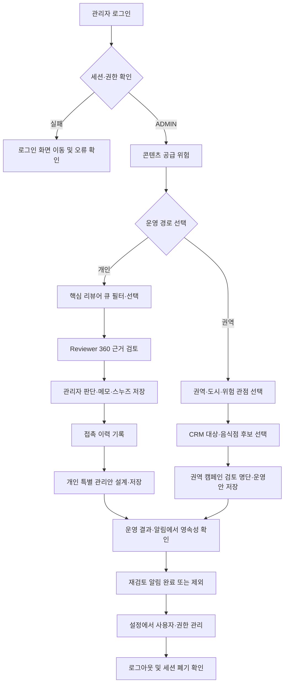
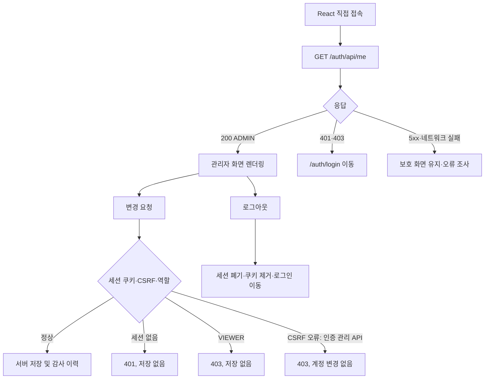
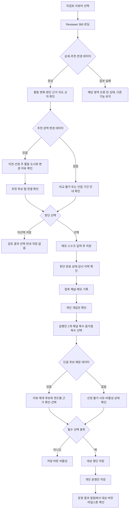
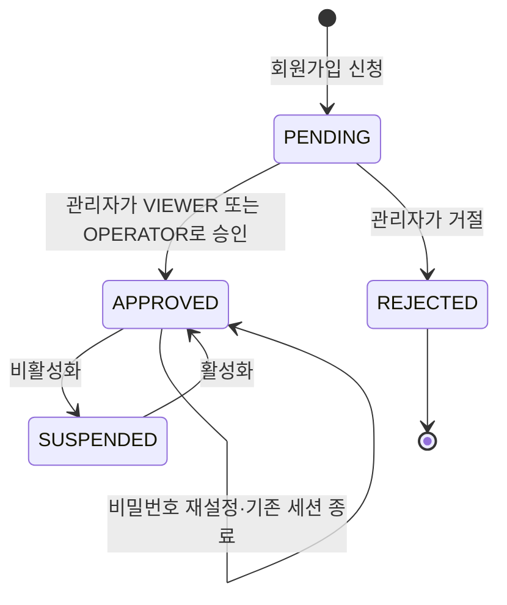
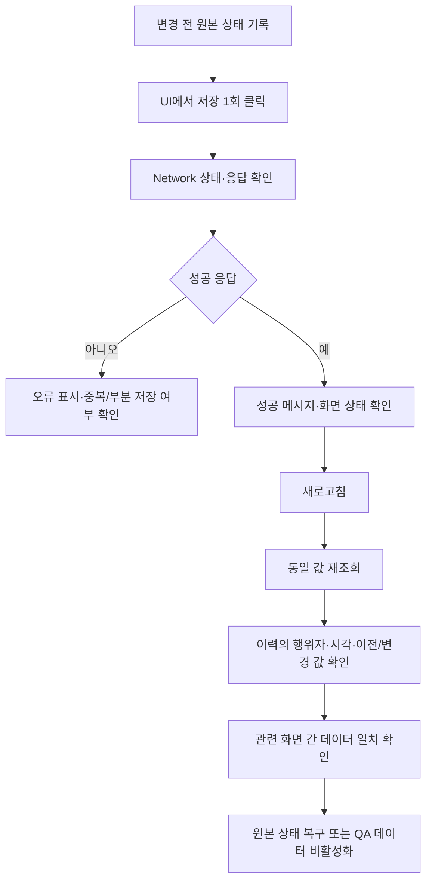
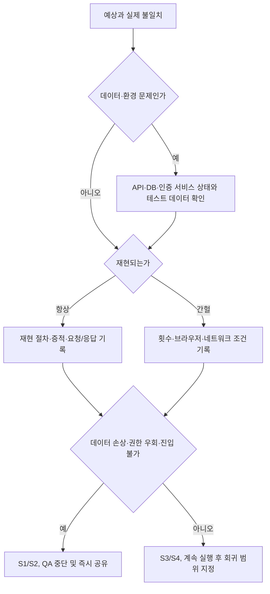

# 관리자 UI QA 흐름도

관련 문서: [QA 문서 안내](README.md) · [QA 계획](ADMIN_UI_QA_PLAN.md) · [QA 테스트 케이스](ADMIN_UI_QA_CASES.md) · [최신 실행 결과](ADMIN_UI_QA_EXECUTION_2026-08-05.md)

## 1. 전체 관리자 E2E 흐름

판정 포인트는 각 저장 직후 성공 메시지만이 아니라 새로고침 후 동일 데이터가 다시
조회되는지, 운영 결과·알림에 같은 대상과 담당자가 연결되는지다.

## 2. 인증·세션·권한 흐름

## 3. 리뷰어 판단과 개인 운영안 흐름

## 4. 권역 캠페인 흐름

```mermaid
flowchart LR
    A["공급·핵심 리뷰어·신규 유입 관점 선택"] --> B["권역 또는 도시 선택"]
    B --> C["관리 대상 CTA"]
    C --> D["권역 종합 큐에서 후보 확인·복수 선택"]
    D --> E["캠페인 설계"]
    E --> F["1 권역·요일 강도·비예측성 안내 확인"]
    F --> G["2 위험 유형 선택"]
    G --> H["3 스폰서·로컬 맛집과 위험 매장 표시 확인·선택"]
    H --> I["4 목적·제목·초안·30·60·90일 검토"]
    I --> P["지역 쿠폰 이벤트 검토 선택 시 비발급·B2C 전달 안내 확인"]
    P --> J{"CRM 후보 존재"}
    J -->|없음| K["다음/저장 비활성 또는 빈 상태"]
    J -->|있음| L["운영 검토 명단 저장"]
    L --> M["권역 운영안 저장"]
    M --> N["실제 발송 아님 문구 확인"]
    N --> O["운영 결과·알림에서 명단·운영안 확인"]
```

## 5. 관리자 계정 수명주기

관리자(`ADMIN`) 계정 자체는 화면에서 생성·역할 변경·비밀번호 재설정하지 않고 서버
CLI 정책을 유지한다.

## 6. 저장 검증 공통 흐름

## 7. 결함 분기 흐름

